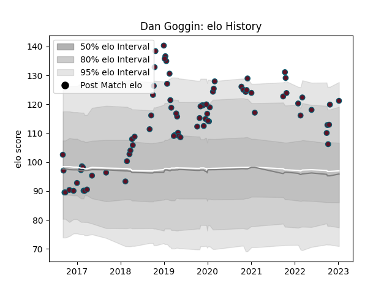

---  
layout: page  
title: Dan Goggin  
date: 2023-01-13 11:28:12.714237  
categories: player  
---
# Dan Goggin

## Positions: C

## Current elo: 121.0

## Current Percentile: 90.0

# Elo History

# Match History

| Team    |   Appearances |   Win Rate |
|:--------|--------------:|-----------:|
| Munster |            79 |   0.753165 |

| Opponent         |   Matches |   Win Rate |
|:-----------------|----------:|-----------:|
| Ospreys          |         8 |   0.875    |
| Zebre            |         7 |   1        |
| Edinburgh        |         7 |   0.714286 |
| Connacht         |         7 |   0.857143 |
| Scarlets         |         6 |   0.666667 |
| Leinster         |         6 |   0.166667 |
| Dragons          |         5 |   0.8      |
| Ulster           |         5 |   0.5      |
| Cardiff Blues    |         4 |   0.75     |
| Southern Kings   |         4 |   1        |
| Benetton Treviso |         4 |   1        |
| Glasgow Warriors |         3 |   1        |
| Exeter Chiefs    |         2 |   0.75     |
| Gloucester Rugby |         2 |   1        |
| Cheetahs         |         2 |   1        |
| Racing 92        |         2 |   0.25     |
| Saracens         |         2 |   0        |
| Bulls            |         1 |   1        |
| Lions            |         1 |   1        |
| Sharks           |         1 |   1        |