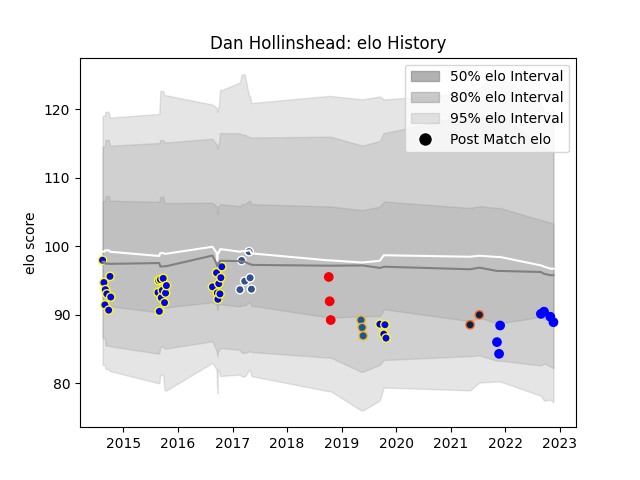

---  
layout: page  
title: Dan Hollinshead  
date: 2023-01-30 11:42:21.705104  
categories: player  
---
# Dan Hollinshead

## Positions: FH, C

## Current elo: 79.0

## Current Percentile: 11.0

# Elo History

# Match History

| Team                 |   Appearances |   Win Rate |
|:---------------------|--------------:|-----------:|
| Bay of Plenty        |            30 |   0.333333 |
| Vannes               |            15 |   0.6      |
| Agen                 |            11 |   0.590909 |
| Coca-Cola Red Sparks |             4 |   0        |
| Highlanders          |             3 |   0.333333 |
| R.U. New York        |             2 |   1        |

| Opponent                          |   Matches |   Win Rate |
|:----------------------------------|----------:|-----------:|
| Taranaki                          |         4 |   0.25     |
| Southland                         |         4 |   0.5      |
| Hawke's Bay                       |         4 |   0.5      |
| Carcassonne                       |         3 |   0.833333 |
| Manawatu                          |         3 |   0.666667 |
| Otago                             |         3 |   0.333333 |
| Beziers                           |         3 |   0.666667 |
| Waikato                           |         2 |   0        |
| Soyaux-Angouleme                  |         2 |   0.5      |
| Nevers                            |         2 |   0.5      |
| Narbonne                          |         2 |   1        |
| Auckland                          |         2 |   0        |
| Colomiers                         |         2 |   0.75     |
| Wellington                        |         2 |   0        |
| Northland                         |         2 |   0.5      |
| Tasman                            |         2 |   0        |
| Montauban                         |         2 |   0.75     |
| Stormers                          |         1 |   0        |
| Rouen                             |         1 |   0        |
| Provence Rugby                    |         1 |   1        |
| Perpignan                         |         1 |   0        |
| Oyonnax                           |         1 |   0        |
| Vannes                            |         1 |   1        |
| Agen                              |         1 |   0        |
| North Harbour                     |         1 |   0        |
| Albi                              |         1 |   0        |
| Mont-de-Marsan                    |         1 |   1        |
| Mie Honda Heat                    |         1 |   0        |
| Lions                             |         1 |   0        |
| L. A. Giltinis                    |         1 |   1        |
| Kubota Spears Funabashi Tokyo-Bay |         1 |   0        |
| Jaguares                          |         1 |   1        |
| Houston SaberCats                 |         1 |   1        |
| Dax                               |         1 |   1        |
| Counties Manukau                  |         1 |   1        |
| Black Rams Tokyo                  |         1 |   0        |
| Aurillac                          |         1 |   0        |
| Yokohama Canon Eagles             |         1 |   0        |