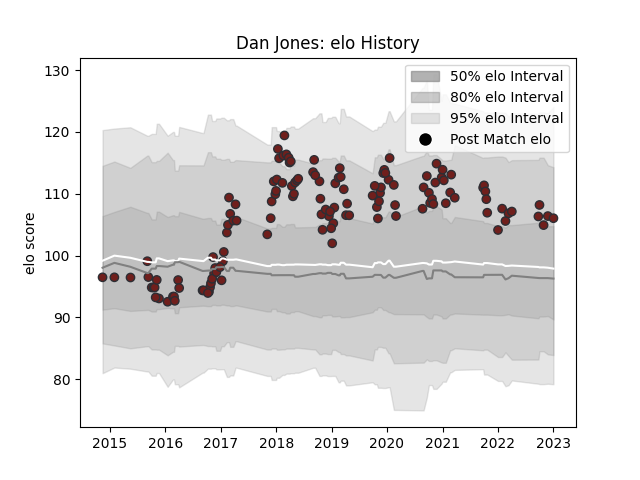

---  
layout: page  
title: Dan Jones  
date: 2023-01-03 11:28:13.567574  
categories: player  
---
# Dan Jones

## Positions: FH

## Current elo: 106.0

## Current Percentile: 77.0

# Elo History

# Match History

| Team     |   Appearances |   Win Rate |
|:---------|--------------:|-----------:|
| Scarlets |           130 |   0.553846 |

| Opponent         |   Matches |   Win Rate |
|:-----------------|----------:|-----------:|
| Benetton Treviso |        13 |   0.769231 |
| Dragons          |        12 |   0.75     |
| Leinster         |        12 |   0.291667 |
| Ulster           |        11 |   0.454545 |
| Edinburgh        |        11 |   0.181818 |
| Cardiff Blues    |        10 |   0.4      |
| Munster          |         8 |   0.375    |
| Glasgow Warriors |         6 |   0.833333 |
| Ospreys          |         6 |   0.666667 |
| Zebre            |         5 |   1        |
| Toulon           |         4 |   0.25     |
| Connacht         |         4 |   0.75     |
| Cheetahs         |         4 |   0.75     |
| Racing 92        |         4 |   0        |
| Southern Kings   |         3 |   1        |
| London Irish     |         3 |   1        |
| Saracens         |         2 |   0.25     |
| Bath Rugby       |         2 |   1        |
| Sale Sharks      |         2 |   0.5      |
| Bayonne          |         2 |   1        |
| Leicester Tigers |         2 |   0.5      |
| Sharks           |         1 |   0        |
| Stormers         |         1 |   0        |
| La Rochelle      |         1 |   1        |
| Lions            |         1 |   1        |