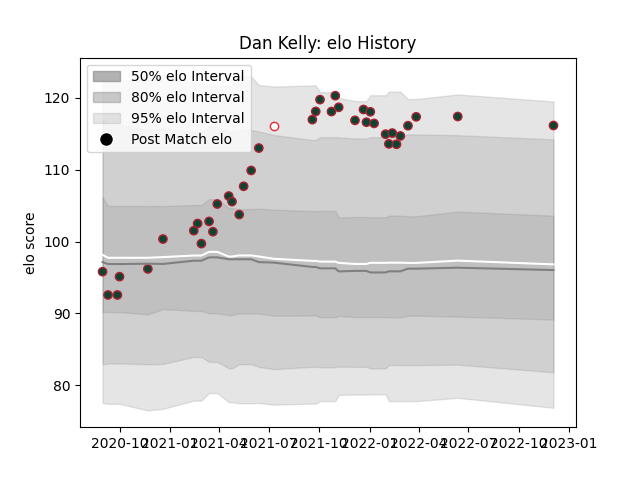

---  
layout: page  
title: Dan Kelly  
date: 2023-01-06 00:12:46.514213  
categories: player  
---
# Dan Kelly

## Positions: C

## Country: England

## Current elo: 125.0

## Current Percentile: 95.0

# Elo History

# Match History

| Team             |   Appearances |   Win Rate |
|:-----------------|--------------:|-----------:|
| Leicester Tigers |            42 |   0.678571 |
| England          |             1 |   1        |
| Manawatu         |             1 |   1        |

| Opponent           |   Matches |   Win Rate |
|:-------------------|----------:|-----------:|
| Gloucester Rugby   |         6 |   0.833333 |
| Bristol Rugby      |         4 |   0.375    |
| Wasps              |         4 |   0.5      |
| Sale Sharks        |         4 |   0.25     |
| Northampton Saints |         4 |   0.75     |
| Bath Rugby         |         3 |   0.666667 |
| Exeter Chiefs      |         3 |   0.666667 |
| Harlequins         |         3 |   0.666667 |
| Newcastle Falcons  |         2 |   1        |
| Worcester Warriors |         2 |   1        |
| London Irish       |         1 |   1        |
| Bayonne            |         1 |   1        |
| Connacht           |         1 |   1        |
| Ospreys            |         1 |   1        |
| Clermont Auvergne  |         1 |   1        |
| Saracens           |         1 |   1        |
| Toulon             |         1 |   0        |
| Canada             |         1 |   1        |
| Hawke's Bay        |         1 |   1        |