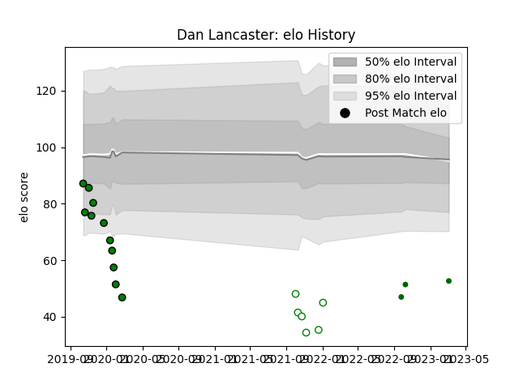

---  
layout: page  
title: Dan Lancaster  
date: 2023-03-12 11:31:26.998076  
categories: player  
---
# Dan Lancaster

## Positions: C, FH

## Current elo: 53.0

## Current Percentile: 1.0

# Elo History

# Match History

| Team                |   Appearances |   Win Rate |
|:--------------------|--------------:|-----------:|
| Yorkshire Carnegie  |            11 |   0        |
| Nottingham          |             6 |   0.166667 |
| Ealing Trailfinders |             3 |   1        |

| Opponent            |   Matches |   Win Rate |
|:--------------------|----------:|-----------:|
| Hartpury College    |         4 |        0.5 |
| Ampthill            |         3 |        0   |
| Cornish Pirates     |         2 |        0   |
| Ealing Trailfinders |         2 |        0   |
| Richmond            |         2 |        1   |
| Bedford             |         1 |        0   |
| Coventry            |         1 |        0   |
| Doncaster           |         1 |        0   |
| Jersey              |         1 |        0   |
| London Scottish     |         1 |        0   |
| Newcastle Falcons   |         1 |        0   |
| Nottingham          |         1 |        0   |