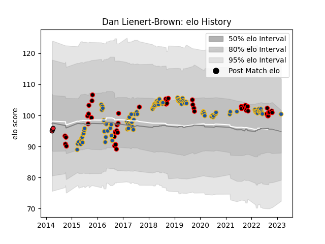

---  
layout: page  
title: Dan Lienert-Brown  
date: 2023-03-02 11:27:06.408099  
categories: player  
---
# Dan Lienert-Brown

## Positions: P

## Country: Highlanders

## Current elo: 100.0

## Current Percentile: 71.0

# Elo History

# Match History

| Team        |   Appearances |   Win Rate |
|:------------|--------------:|-----------:|
| Highlanders |           102 |   0.514706 |
| Canterbury  |            53 |   0.716981 |
| Crusaders   |             3 |   0.666667 |

| Opponent                 |   Matches |   Win Rate |
|:-------------------------|----------:|-----------:|
| Hurricanes               |        15 |   0.266667 |
| Crusaders                |        14 |   0.142857 |
| Blues                    |        13 |   0.461538 |
| Chiefs                   |        12 |   0.625    |
| New South Wales Waratahs |         8 |   0.625    |
| Tasman                   |         8 |   0.625    |
| Brumbies                 |         6 |   0.833333 |
| Lions                    |         6 |   0.5      |
| Manawatu                 |         6 |   0.666667 |
| Melbourne Rebels         |         5 |   0.4      |
| Taranaki                 |         5 |   0.8      |
| Queensland Reds          |         5 |   0.8      |
| Wellington               |         4 |   0.5      |
| Stormers                 |         4 |   0.75     |
| Otago                    |         4 |   0.75     |
| North Harbour            |         4 |   1        |
| Auckland                 |         4 |   0.5      |
| Bay of Plenty            |         3 |   1        |
| Northland                |         3 |   1        |
| Hawke's Bay              |         3 |   0.666667 |
| Sharks                   |         3 |   0        |
| Southland                |         3 |   0.666667 |
| Counties Manukau         |         3 |   0.666667 |
| Cheetahs                 |         3 |   1        |
| Bulls                    |         3 |   0.666667 |
| Waikato                  |         3 |   0.666667 |
| Western Force            |         3 |   1        |
| Sunwolves                |         2 |   1        |
| Fijian Drua              |         1 |   1        |
| Southern Kings           |         1 |   1        |
| British and Irish Lions  |         1 |   1        |