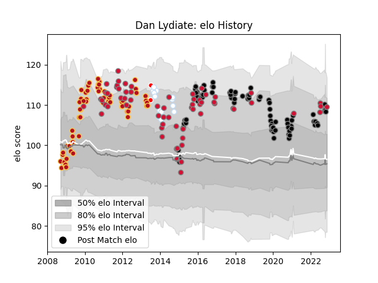

---  
layout: page  
title: Dan Lydiate  
date: 2022-11-16 11:32:37.172440  
categories: player  
---
# Dan Lydiate

## Positions: FL

## Country: Wales

## Current elo: 110.0

## Current Percentile: 84.0

# Elo History

# Match History

| Team                    |   Appearances |   Win Rate |
|:------------------------|--------------:|-----------:|
| Ospreys                 |            83 |   0.536145 |
| Dragons                 |            71 |   0.316901 |
| Wales                   |            63 |   0.555556 |
| Racing 92               |            14 |   0.428571 |
| British and Irish Lions |             2 |   0.5      |

| Opponent           |   Matches |   Win Rate |
|:-------------------|----------:|-----------:|
| Scarlets           |        16 |   0.15625  |
| Australia          |        13 |   0.153846 |
| Cardiff Blues      |        13 |   0.538462 |
| Munster            |        12 |   0.166667 |
| Glasgow Warriors   |        12 |   0.583333 |
| South Africa       |        11 |   0.363636 |
| Ulster             |        10 |   0.35     |
| Connacht           |         9 |   0.555556 |
| Ospreys            |         8 |   0.625    |
| Leinster           |         8 |   0.25     |
| Benetton Treviso   |         8 |   0.75     |
| Dragons            |         8 |   0.75     |
| Edinburgh          |         7 |   0.571429 |
| England            |         7 |   0.285714 |
| Ireland            |         7 |   0.785714 |
| Scotland           |         6 |   1        |
| Stade Toulousain   |         6 |   0.166667 |
| France             |         6 |   0.666667 |
| Italy              |         5 |   1        |
| Zebre              |         5 |   0.8      |
| Clermont Auvergne  |         4 |   0        |
| Cheetahs           |         4 |   0.5      |
| Bordeaux Begles    |         4 |   0.5      |
| Fiji               |         3 |   0.833333 |
| Exeter Chiefs      |         3 |   0.333333 |
| Gloucester Rugby   |         3 |   0        |
| Southern Kings     |         2 |   0.5      |
| Stormers           |         2 |   0.25     |
| Racing 92          |         2 |   0        |
| Lions              |         2 |   0        |
| Wasps              |         2 |   0        |
| New Zealand        |         2 |   0        |
| Newcastle Falcons  |         2 |   1        |
| Northampton Saints |         2 |   1        |
| Brive              |         2 |   0.75     |
| Worcester Warriors |         1 |   1        |
| Saracens           |         1 |   0        |
| Uruguay            |         1 |   1        |
| Toulon             |         1 |   1        |
| Argentina          |         1 |   1        |
| Samoa              |         1 |   1        |
| Perpignan          |         1 |   0        |
| Oyonnax            |         1 |   1        |
| Lyon               |         1 |   1        |
| Harlequins         |         1 |   0        |
| Grenoble           |         1 |   0        |
| Georgia            |         1 |   1        |
| Cavalieri Prato    |         1 |   1        |
| Castres Olympique  |         1 |   1        |
| Bulls              |         1 |   0        |
| Biarritz Olympique |         1 |   0        |
| Japan              |         1 |   1        |