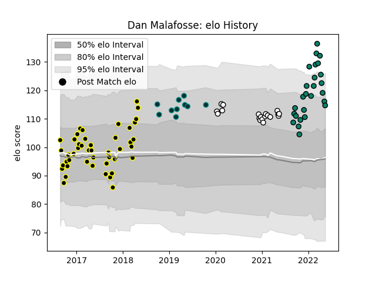

---  
layout: page  
title: Dan Malafosse  
date: 2023-02-15 22:13:38.328401  
categories: player  
---
# Dan Malafosse

## Positions: L

## Current elo: 118.0

## Current Percentile: 92.0

# Elo History

# Match History

| Team           |   Appearances |   Win Rate |
|:---------------|--------------:|-----------:|
| Mont-de-Marsan |            45 |   0.577778 |
| Montauban      |            27 |   0.481481 |
| Brive          |            19 |   0.421053 |
| Pau            |            10 |   0.4      |

| Opponent             |   Matches |   Win Rate |
|:---------------------|----------:|-----------:|
| Agen                 |         7 |   0.571429 |
| Beziers              |         6 |   0.833333 |
| Montauban            |         5 |   0.4      |
| Bayonne              |         5 |   0.2      |
| Perpignan            |         5 |   0.6      |
| Vannes               |         5 |   0.4      |
| Carcassonne          |         4 |   0.75     |
| Stade Francais Paris |         4 |   0.25     |
| Colomiers            |         4 |   0.5      |
| Aurillac             |         4 |   0.5      |
| Narbonne             |         4 |   0.75     |
| Toulon               |         3 |   0.333333 |
| Nevers               |         3 |   0.666667 |
| Grenoble             |         3 |   0.166667 |
| Lyon                 |         3 |   0.333333 |
| Biarritz Olympique   |         3 |   0.333333 |
| Oyonnax              |         3 |   0.666667 |
| Stade Toulousain     |         2 |   0        |
| Soyaux-Angouleme     |         2 |   0.5      |
| Rouen                |         2 |   1        |
| Provence Rugby       |         2 |   0        |
| Ospreys              |         2 |   0.5      |
| Mont-de-Marsan       |         2 |   0.5      |
| Albi                 |         2 |   1        |
| Dax                  |         2 |   0.5      |
| Clermont Auvergne    |         2 |   0        |
| Bourgoin-Jallieu     |         2 |   1        |
| Montpellier Herault  |         1 |   1        |
| Pau                  |         1 |   1        |
| Massy                |         1 |   0        |
| Leicester Tigers     |         1 |   0        |
| Racing 92            |         1 |   1        |
| La Rochelle          |         1 |   1        |
| Castres Olympique    |         1 |   1        |
| Bristol Rugby        |         1 |   0        |
| US Bressane          |         1 |   0.5      |
| Zebre                |         1 |   0        |