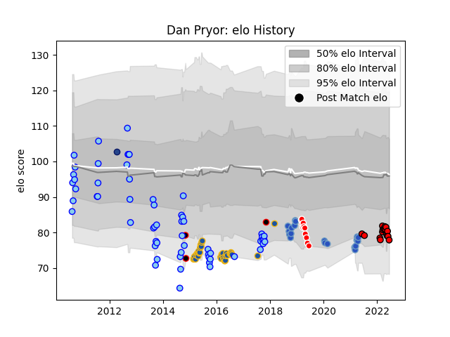

---  
layout: page  
title: Dan Pryor  
date: 2023-03-09 10:07:13.167467  
categories: player  
---
# Dan Pryor

## Positions: FL, N8

## Country: New Zealand Maori

## Current elo: 78.0

## Current Percentile: 11.0

# Elo History

# Match History

| Team                 |   Appearances |   Win Rate |
|:---------------------|--------------:|-----------:|
| Northland            |            59 |   0.330508 |
| Highlanders          |            34 |   0.705882 |
| Munakata Sanix Blues |            19 |   0.210526 |
| San Diego Legion     |            17 |   0.411765 |
| Sunwolves            |            11 |   0.181818 |
| New Zealand Maori    |             3 |   1        |
| Blues                |             1 |   0        |

| Opponent                         |   Matches |   Win Rate |
|:---------------------------------|----------:|-----------:|
| Otago                            |         7 |   0.571429 |
| Auckland                         |         6 |   0        |
| Bay of Plenty                    |         6 |   0.666667 |
| Manawatu                         |         6 |   0.166667 |
| North Harbour                    |         6 |   0.416667 |
| Chiefs                           |         6 |   1        |
| Blues                            |         5 |   0.6      |
| Wellington                       |         5 |   0.2      |
| Hurricanes                       |         5 |   0.2      |
| Hawke's Bay                      |         4 |   0.5      |
| Lions                            |         4 |   0.25     |
| Southland                        |         4 |   0.5      |
| Queensland Reds                  |         4 |   0.5      |
| Taranaki                         |         4 |   0        |
| Brumbies                         |         4 |   0.5      |
| Melbourne Rebels                 |         4 |   0.25     |
| Crusaders                        |         3 |   0.666667 |
| Counties Manukau                 |         3 |   0        |
| Waikato                          |         3 |   0.666667 |
| Canterbury                       |         3 |   0        |
| Tasman                           |         2 |   0.5      |
| Austin Gilgronis                 |         2 |   0        |
| Tokyo Sungoliath                 |         2 |   0        |
| Seattle Seawolves                |         2 |   0        |
| Toyota Industries Shuttles Aichi |         2 |   0.5      |
| Sharks                           |         2 |   0.5      |
| Jaguares                         |         2 |   0.5      |
| Mie Honda Heat                   |         2 |   0.5      |
| L. A. Giltinis                   |         2 |   0.5      |
| Japan                            |         2 |   1        |
| Toyota Verblitz                  |         2 |   0        |
| Hino Red Dolphins                |         2 |   0.5      |
| Urayasu D-Rocks                  |         2 |   0        |
| Utah Warriors                    |         2 |   1        |
| Green Rockets Tokatsu            |         2 |   0.5      |
| Dallas Jackals                   |         2 |   1        |
| Western Force                    |         2 |   1        |
| Toshiba Brave Lupus Tokyo        |         1 |   0        |
| Toronto Arrows                   |         1 |   1        |
| Stormers                         |         1 |   1        |
| Mitsubishi Dynaboars             |         1 |   0        |
| Southern Kings                   |         1 |   1        |
| Rugby New York                   |         1 |   0        |
| Rugby ATL                        |         1 |   0        |
| R.U. New York                    |         1 |   0        |
| Old Glory DC                     |         1 |   0        |
| New South Wales Waratahs         |         1 |   1        |
| NOLA Gold                        |         1 |   1        |
| Houston SaberCats                |         1 |   0        |
| Highlanders                      |         1 |   0        |
| Hanazono Kintetsu Liners         |         1 |   0        |
| Cheetahs                         |         1 |   1        |
| Canada                           |         1 |   1        |
| Black Rams Tokyo                 |         1 |   0        |
| Yokohama Canon Eagles            |         1 |   0        |