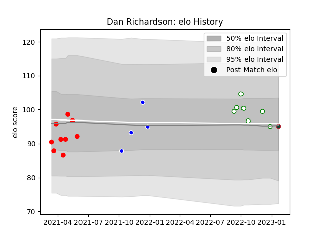

---  
layout: page  
title: Dan Richardson  
date: 2022-12-31 16:29:20.442744  
categories: player  
---
# Dan Richardson

## Positions: P

## Current elo: 101.0

## Current Percentile: 81.0

# Elo History

# Match History

| Team       |   Appearances |   Win Rate |
|:-----------|--------------:|-----------:|
| Jersey     |             9 |   0.444444 |
| Nottingham |             7 |   0.428571 |
| Coventry   |             4 |   0.5      |

| Opponent            |   Matches |   Win Rate |
|:--------------------|----------:|-----------:|
| Ampthill            |         2 |        1   |
| Bedford             |         2 |        0.5 |
| Cornish Pirates     |         2 |        0.5 |
| Coventry            |         2 |        0   |
| Doncaster           |         2 |        0.5 |
| Hartpury College    |         2 |        0   |
| Nottingham          |         2 |        1   |
| Richmond            |         2 |        0.5 |
| Ealing Trailfinders |         1 |        0   |
| Jersey              |         1 |        0   |
| London Scottish     |         1 |        1   |
| Saracens            |         1 |        0   |