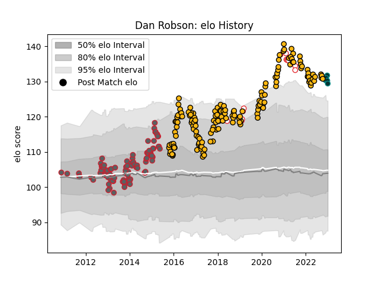

---  
layout: page  
title: Dan Robson  
date: 2022-12-14 11:36:09.581368  
categories: player  
---
# Dan Robson

## Positions: SH

## Country: England

## Current elo: 120.0

## Current Percentile: 95.0

# Elo History

# Match History

| Team             |   Appearances |   Win Rate |
|:-----------------|--------------:|-----------:|
| Wasps            |           156 |   0.608974 |
| Gloucester Rugby |            95 |   0.526316 |
| England          |            12 |   0.583333 |
| Pau              |             2 |   0.5      |

| Opponent           |   Matches |   Win Rate |
|:-------------------|----------:|-----------:|
| Bath Rugby         |        23 |   0.652174 |
| Exeter Chiefs      |        22 |   0.431818 |
| Harlequins         |        20 |   0.4      |
| Northampton Saints |        19 |   0.605263 |
| Sale Sharks        |        19 |   0.368421 |
| Leicester Tigers   |        17 |   0.470588 |
| Worcester Warriors |        16 |   0.90625  |
| Saracens           |        16 |   0.4375   |
| London Irish       |        15 |   0.766667 |
| Newcastle Falcons  |        14 |   0.857143 |
| Gloucester Rugby   |        11 |   0.5      |
| Bristol Rugby      |         8 |   0.75     |
| Wasps              |         7 |   0.142857 |
| Edinburgh          |         4 |   0.5      |
| Bordeaux Begles    |         4 |   0.5      |
| London Welsh       |         4 |   1        |
| Leinster           |         4 |   0.5      |
| Munster            |         3 |   0        |
| Zebre              |         3 |   1        |
| Italy              |         3 |   1        |
| Connacht           |         3 |   0.666667 |
| Brive              |         3 |   1        |
| Ulster             |         2 |   0.5      |
| Ireland            |         2 |   0.5      |
| France             |         2 |   1        |
| Ospreys            |         2 |   0.5      |
| Oyonnax            |         2 |   1        |
| Perpignan          |         2 |   1        |
| La Rochelle        |         2 |   0.5      |
| Wales              |         2 |   0        |
| Stade Toulousain   |         2 |   0.75     |
| Toulon             |         2 |   0.5      |
| Barbarians         |         1 |   0        |
| Biarritz Olympique |         1 |   0        |
| Castres Olympique  |         1 |   0        |
| Scotland           |         1 |   0        |
| Canada             |         1 |   1        |
| Mont-de-Marsan     |         1 |   1        |
| Agen               |         1 |   1        |