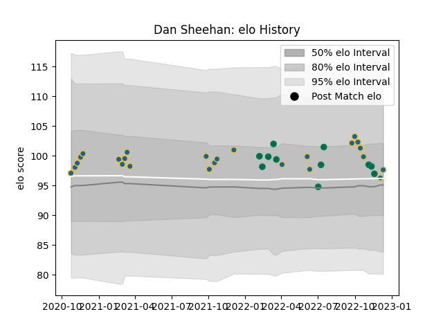

---  
layout: page  
title: Dan Sheehan  
date: 2022-11-15 23:37:21.088991  
categories: player  
---
# Dan Sheehan

## Positions: H

## Country: Ireland

## Current elo: 98.0

## Current Percentile: 62.0

# Elo History

# Match History

| Team     |   Appearances |   Win Rate |
|:---------|--------------:|-----------:|
| Leinster |            23 |   0.913043 |
| Ireland  |            10 |   0.8      |

| Opponent         |   Matches |   Win Rate |
|:-----------------|----------:|-----------:|
| Glasgow Warriors |         4 |   1        |
| New Zealand      |         3 |   0.666667 |
| Zebre            |         2 |   1        |
| Connacht         |         2 |   1        |
| Dragons          |         2 |   1        |
| Ulster           |         2 |   1        |
| Bulls            |         2 |   0.5      |
| Munster          |         2 |   1        |
| Ospreys          |         2 |   0.5      |
| Scarlets         |         1 |   1        |
| Wales            |         1 |   1        |
| South Africa     |         1 |   1        |
| Sharks           |         1 |   1        |
| Scotland         |         1 |   1        |
| Benetton Treviso |         1 |   1        |
| France           |         1 |   0        |
| Fiji             |         1 |   1        |
| England          |         1 |   1        |
| Edinburgh        |         1 |   1        |
| Cardiff Blues    |         1 |   1        |
| Italy            |         1 |   1        |