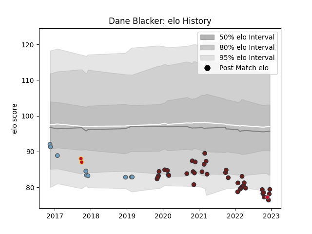

---  
layout: page  
title: Dane Blacker  
date: 2023-02-02 18:54:03.520398  
categories: player  
---
# Dane Blacker

## Positions: SH

## Country: Wales

## Current elo: 64.0

## Current Percentile: 1.0

# Elo History

# Match History

| Team          |   Appearances |   Win Rate |
|:--------------|--------------:|-----------:|
| Scarlets      |            44 |   0.545455 |
| Cardiff Blues |             9 |   0.111111 |
| Dragons       |             2 |   0.5      |
| Wales         |             1 |   0        |

| Opponent          |   Matches |   Win Rate |
|:------------------|----------:|-----------:|
| Edinburgh         |         5 |   0.4      |
| Benetton Treviso  |         5 |   0.8      |
| Connacht          |         4 |   0.5      |
| Cheetahs          |         3 |   1        |
| Glasgow Warriors  |         3 |   0.333333 |
| Dragons           |         3 |   0.666667 |
| Zebre             |         3 |   1        |
| Cardiff Blues     |         3 |   0.666667 |
| Ulster            |         3 |   0        |
| Ospreys           |         3 |   0        |
| Bulls             |         2 |   0.5      |
| Southern Kings    |         2 |   1        |
| Lions             |         2 |   0.5      |
| London Irish      |         2 |   1        |
| Munster           |         2 |   0        |
| Sale Sharks       |         1 |   0        |
| Sharks            |         1 |   0        |
| Toulon            |         1 |   0        |
| Saracens          |         1 |   0        |
| Bayonne           |         1 |   1        |
| Newcastle Falcons |         1 |   0        |
| Georgia           |         1 |   0        |
| Exeter Chiefs     |         1 |   0        |
| Bristol Rugby     |         1 |   0        |
| Bordeaux Begles   |         1 |   0        |
| Leinster          |         1 |   0        |