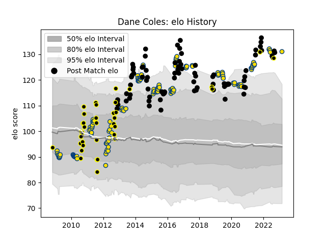

---  
layout: page  
title: Dane Coles  
date: 2023-03-02 11:27:53.656281  
categories: player  
---
# Dane Coles

## Positions: H

## Country: New Zealand

## Current elo: 131.0

## Current Percentile: 98.0

# Elo History

# Match History

| Team        |   Appearances |   Win Rate |
|:------------|--------------:|-----------:|
| Hurricanes  |           138 |   0.619565 |
| New Zealand |            86 |   0.831395 |
| Wellington  |            36 |   0.583333 |

| Opponent                 |   Matches |   Win Rate |
|:-------------------------|----------:|-----------:|
| Australia                |        21 |   0.809524 |
| Blues                    |        17 |   0.529412 |
| Chiefs                   |        16 |   0.625    |
| Highlanders              |        15 |   0.6      |
| South Africa             |        13 |   0.807692 |
| Crusaders                |        13 |   0.5      |
| Argentina                |        11 |   0.909091 |
| Brumbies                 |        11 |   0.454545 |
| Sharks                   |         9 |   0.444444 |
| Lions                    |         9 |   0.888889 |
| England                  |         8 |   0.75     |
| New South Wales Waratahs |         8 |   0.625    |
| Western Force            |         7 |   0.857143 |
| France                   |         7 |   0.857143 |
| Ireland                  |         7 |   0.428571 |
| Queensland Reds          |         7 |   0.857143 |
| Canterbury               |         6 |   0.333333 |
| Melbourne Rebels         |         6 |   0.833333 |
| Wales                    |         6 |   1        |
| Bulls                    |         6 |   0.5      |
| Auckland                 |         5 |   0        |
| Cheetahs                 |         5 |   0.6      |
| Stormers                 |         4 |   0.25     |
| Taranaki                 |         4 |   1        |
| Hawke's Bay              |         3 |   0.666667 |
| Italy                    |         3 |   1        |
| Bay of Plenty            |         3 |   0.333333 |
| Tonga                    |         2 |   1        |
| Waikato                  |         2 |   1        |
| Scotland                 |         2 |   1        |
| Southland                |         2 |   1        |
| Southern Kings           |         2 |   1        |
| Counties Manukau         |         2 |   0.5      |
| Otago                    |         2 |   1        |
| Northland                |         2 |   0.5      |
| Manawatu                 |         2 |   0.5      |
| Japan                    |         2 |   1        |
| North Harbour            |         2 |   1        |
| Namibia                  |         1 |   1        |
| Sunwolves                |         1 |   1        |
| Jaguares                 |         1 |   1        |
| Tasman                   |         1 |   1        |
| Georgia                  |         1 |   1        |
| United States of America |         1 |   1        |
| Fijian Drua              |         1 |   1        |
| Fiji                     |         1 |   1        |