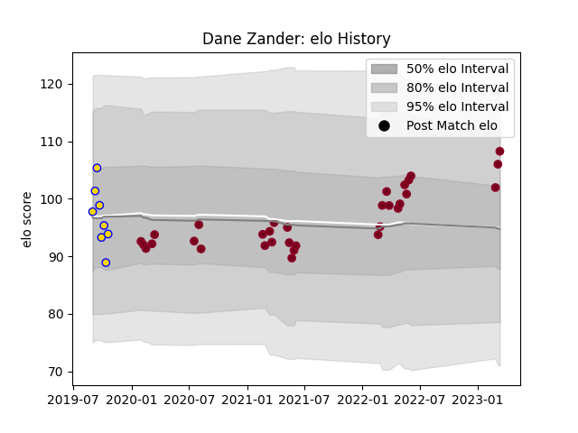

---  
layout: page  
title: Dane Zander  
date: 2023-03-21 18:29:13.777434  
categories: player  
---
# Dane Zander

Last updated: 2023-03-21
## Positions: P

## Current elo: 106.0

## Current Percentile: 84.0

# Elo History

# Match History

| Team            |   Appearances |   Win Rate |
|:----------------|--------------:|-----------:|
| Queensland Reds |            33 |   0.484848 |
| Brisbane City   |             8 |   0.4375   |

| Opponent                 |   Matches |   Win Rate |
|:-------------------------|----------:|-----------:|
| Western Force            |         6 |   0.666667 |
| Brumbies                 |         6 |   0.333333 |
| New South Wales Waratahs |         5 |   0.8      |
| Crusaders                |         4 |   0        |
| Hurricanes               |         2 |   0        |
| Melbourne Rebels         |         2 |   1        |
| Blues                    |         2 |   0        |
| Fijian Drua              |         2 |   0.75     |
| Chiefs                   |         2 |   0.5      |
| Highlanders              |         1 |   0        |
| Lions                    |         1 |   0        |
| Canberra Vikings         |         1 |   0        |
| Melbourne Rising         |         1 |   1        |
| Moana Pasifika           |         1 |   1        |
| NSW Country Eagles       |         1 |   1        |
| Bulls                    |         1 |   1        |
| Queensland Country       |         1 |   0        |
| Sydney Rays              |         1 |   1        |
| Jaguares                 |         1 |   0        |