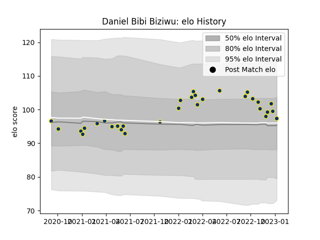

---  
layout: page  
title: Daniel Bibi Biziwu  
date: 2023-01-13 11:28:30.388346  
categories: player  
---
# Daniel Bibi Biziwu

## Positions: P

## Current elo: 97.0

## Current Percentile: 72.0

# Elo History

# Match History

| Team              |   Appearances |   Win Rate |
|:------------------|--------------:|-----------:|
| Clermont Auvergne |            31 |   0.548387 |

| Opponent             |   Matches |   Win Rate |
|:---------------------|----------:|-----------:|
| Stade Toulousain     |         4 |   0.5      |
| Pau                  |         3 |   1        |
| Racing 92            |         3 |   0        |
| Toulon               |         3 |   0.333333 |
| Agen                 |         2 |   1        |
| Bordeaux Begles      |         2 |   0.5      |
| Brive                |         2 |   0.5      |
| La Rochelle          |         2 |   0.5      |
| Lyon                 |         2 |   0.5      |
| Montpellier Herault  |         2 |   1        |
| Perpignan            |         2 |   1        |
| Bayonne              |         1 |   0        |
| Castres Olympique    |         1 |   0        |
| Leicester Tigers     |         1 |   0        |
| Stade Francais Paris |         1 |   1        |