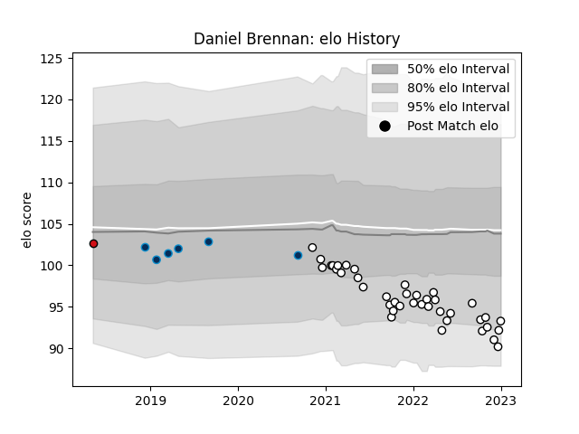

---  
layout: page  
title: Daniel Brennan  
date: 2023-01-06 00:08:30.514866  
categories: player  
---
# Daniel Brennan

## Positions: P

## Current elo: 93.0

## Current Percentile: 9.0

# Elo History

# Match History

| Team                |   Appearances |   Win Rate |
|:--------------------|--------------:|-----------:|
| Brive               |            40 |        0.3 |
| Montpellier Herault |             6 |        0.5 |
| Stade Toulousain    |             1 |        0   |

| Opponent             |   Matches |   Win Rate |
|:---------------------|----------:|-----------:|
| Toulon               |         7 |   0.428571 |
| Lyon                 |         5 |   0.2      |
| Pau                  |         5 |   0.6      |
| Clermont Auvergne    |         4 |   0.25     |
| Stade Toulousain     |         4 |   0        |
| La Rochelle          |         4 |   0        |
| Racing 92            |         4 |   0.25     |
| Bordeaux Begles      |         3 |   0.333333 |
| Stade Francais Paris |         2 |   1        |
| Perpignan            |         1 |   0        |
| Agen                 |         1 |   1        |
| Montpellier Herault  |         1 |   0        |
| Bayonne              |         1 |   0        |
| Leicester Tigers     |         1 |   0        |
| Grenoble             |         1 |   1        |
| Connacht             |         1 |   0        |
| Castres Olympique    |         1 |   1        |
| Zebre                |         1 |   0        |