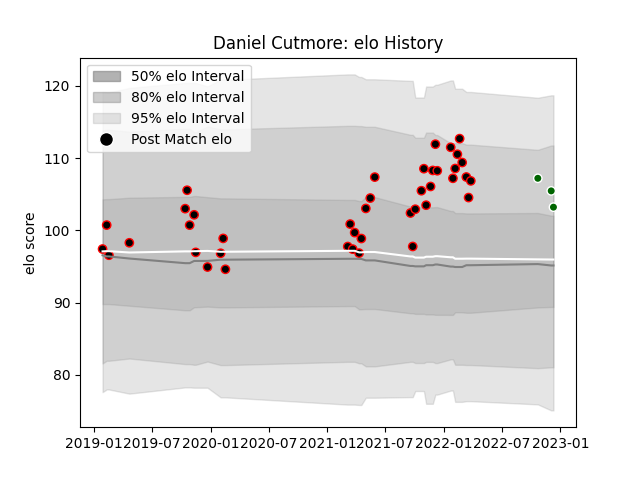

---  
layout: page  
title: Daniel Cutmore  
date: 2023-01-13 11:38:05.818843  
categories: player  
---
# Daniel Cutmore

## Positions: L

## Current elo: 97.0

## Current Percentile: 74.0

# Elo History

# Match History

| Team                |   Appearances |   Win Rate |
|:--------------------|--------------:|-----------:|
| Cornish Pirates     |            55 |        0.7 |
| Ealing Trailfinders |             5 |        0.8 |

| Opponent            |   Matches |   Win Rate |
|:--------------------|----------:|-----------:|
| Bedford             |         6 |   0.833333 |
| Doncaster           |         6 |   0.666667 |
| Ealing Trailfinders |         6 |   0.333333 |
| Hartpury College    |         6 |   0.833333 |
| Jersey              |         6 |   0.5      |
| Nottingham          |         6 |   1        |
| Coventry            |         5 |   0.8      |
| London Scottish     |         5 |   0.6      |
| Richmond            |         5 |   0.9      |
| Ampthill            |         3 |   1        |
| Newcastle Falcons   |         2 |   0        |
| Caldy               |         1 |   0        |
| Cornish Pirates     |         1 |   1        |
| Saracens            |         1 |   1        |
| Yorkshire Carnegie  |         1 |   1        |