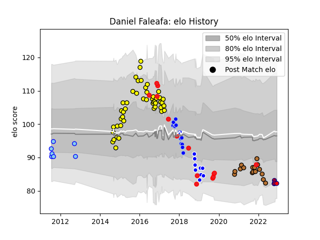

---  
layout: page  
title: Daniel Faleafa  
date: 2022-12-18 16:25:23.106814  
categories: player  
---
# Daniel Faleafa

## Positions: FL, N8

## Country: Tonga

## Current elo: 82.0

## Current Percentile: 9.0

# Elo History

# Match History

| Team                       |   Appearances |   Win Rate |
|:---------------------------|--------------:|-----------:|
| Albi                       |            47 |   0.510638 |
| Narbonne                   |            16 |   0.28125  |
| Tonga                      |            14 |   0.357143 |
| Colomiers                  |            12 |   0.375    |
| Coventry                   |            10 |   0.4      |
| Northland                  |             7 |   0.571429 |
| Cognac Saint Jean d'Angély |             6 |   0        |

| Opponent                 |   Matches |   Win Rate |
|:-------------------------|----------:|-----------:|
| Biarritz Olympique       |         6 |   0.5      |
| Narbonne                 |         6 |   0.666667 |
| Montauban                |         5 |   0.4      |
| Aurillac                 |         5 |   0.6      |
| Beziers                  |         5 |   0        |
| Dax                      |         4 |   0.75     |
| Vannes                   |         4 |   0.125    |
| Bourgoin-Jallieu         |         4 |   0.75     |
| Perpignan                |         4 |   0        |
| Carcassonne              |         4 |   0.375    |
| Mont-de-Marsan           |         3 |   0        |
| Oyonnax                  |         3 |   0        |
| Agen                     |         3 |   0.333333 |
| Soyaux-Angouleme         |         3 |   0.666667 |
| Blagnac                  |         3 |   0.666667 |
| Provence Rugby           |         2 |   1        |
| Wales                    |         2 |   0        |
| Massy                    |         2 |   1        |
| London Scottish          |         2 |   0.5      |
| Pau                      |         2 |   0.5      |
| United States of America |         2 |   1        |
| Suresnes                 |         2 |   0.5      |
| Georgia                  |         2 |   0        |
| Ealing Trailfinders      |         2 |   0        |
| Tasman                   |         2 |   1        |
| Rennes                   |         1 |   0        |
| Richmond                 |         1 |   0        |
| Romania                  |         1 |   0        |
| Otago                    |         1 |   1        |
| US Bressane              |         1 |   0        |
| New Zealand              |         1 |   0        |
| Nevers                   |         1 |   0        |
| Spain                    |         1 |   1        |
| Tarbes                   |         1 |   1        |
| Japan                    |         1 |   0        |
| Manawatu                 |         1 |   0        |
| Lyon                     |         1 |   0        |
| Bayonne                  |         1 |   0        |
| Bedford                  |         1 |   0        |
| Canterbury               |         1 |   0        |
| Carqueiranne-Hyères      |         1 |   0        |
| Chambery                 |         1 |   0        |
| Colomiers                |         1 |   1        |
| Cornish Pirates          |         1 |   1        |
| Counties Manukau         |         1 |   0        |
| Dijon                    |         1 |   0        |
| Doncaster                |         1 |   0        |
| England                  |         1 |   0        |
| Fiji                     |         1 |   1        |
| France                   |         1 |   0        |
| Hartpury College         |         1 |   1        |
| Hawke's Bay              |         1 |   1        |
| Italy                    |         1 |   1        |
| Albi                     |         1 |   0        |
| Yorkshire Carnegie       |         1 |   1        |