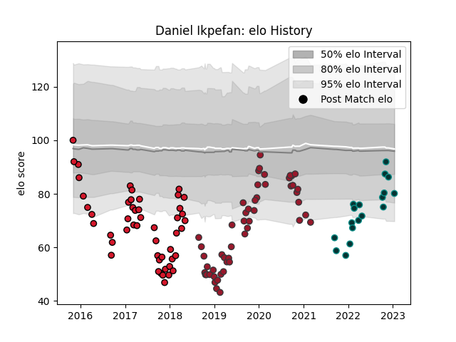

---  
layout: page  
title: Daniel Ikpefan  
date: 2022-11-16 11:31:43.864793  
categories: player  
---
# Daniel Ikpefan

## Positions: W

## Current elo: 100.0

## Current Percentile: 56.0

# Elo History

# Match History

| Team    |   Appearances |   Win Rate |
|:--------|--------------:|-----------:|
| Toulon  |            51 |   0.539216 |
| Oyonnax |            49 |   0.377551 |
| Pau     |            16 |   0.5      |

| Opponent             |   Matches |   Win Rate |
|:---------------------|----------:|-----------:|
| La Rochelle          |         9 |   0.277778 |
| Lyon                 |         8 |   0.5      |
| Stade Francais Paris |         7 |   0.285714 |
| Racing 92            |         7 |   0.285714 |
| Brive                |         7 |   0.428571 |
| Bordeaux Begles      |         6 |   0.5      |
| Stade Toulousain     |         6 |   0.333333 |
| Clermont Auvergne    |         6 |   0.75     |
| Pau                  |         6 |   0.666667 |
| Agen                 |         6 |   0.666667 |
| Castres Olympique    |         5 |   0.6      |
| Montpellier Herault  |         5 |   0.2      |
| Perpignan            |         4 |   1        |
| Scarlets             |         3 |   1        |
| Saracens             |         2 |   0        |
| Toulon               |         2 |   0.5      |
| Newcastle Falcons    |         2 |   0.5      |
| London Irish         |         2 |   0.5      |
| Colomiers            |         2 |   0        |
| Grenoble             |         2 |   0        |
| Bayonne              |         2 |   0        |
| Beziers              |         2 |   0.5      |
| Biarritz Olympique   |         2 |   0.5      |
| Bourgoin-Jallieu     |         1 |   1        |
| Ulster               |         1 |   0        |
| Aurillac             |         1 |   1        |
| Soyaux-Angouleme     |         1 |   1        |
| Albi                 |         1 |   1        |
| Leicester Tigers     |         1 |   1        |
| Connacht             |         1 |   0        |
| Dax                  |         1 |   0        |
| Edinburgh            |         1 |   0        |
| Narbonne             |         1 |   1        |
| Montauban            |         1 |   0        |
| Mont-de-Marsan       |         1 |   1        |
| Vannes               |         1 |   0        |