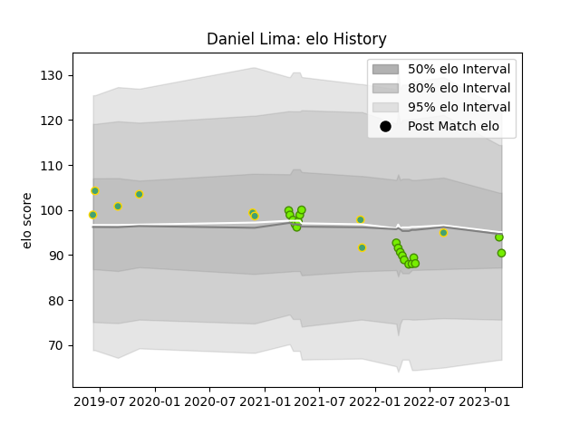

---  
layout: page  
title: Daniel Lima  
date: 2023-03-04 11:43:16.369877  
categories: player  
---
# Daniel Lima

## Positions: W

## Country: Brazil

## Current elo: 90.0

## Current Percentile: 47.0

# Elo History

# Match History

| Team   |   Appearances |   Win Rate |
|:-------|--------------:|-----------:|
| Cobras |            19 |   0.157895 |
| Brazil |             9 |   0.111111 |

| Opponent      |   Matches |   Win Rate |
|:--------------|----------:|-----------:|
| Olimpia Lions |         4 |   0.25     |
| Penarol Rugby |         4 |   0        |
| Cafeteros Pro |         3 |   0.333333 |
| Jaguares XV   |         3 |   0        |
| Portugal      |         3 |   0.333333 |
| Selknam       |         3 |   0.333333 |
| Chile         |         1 |   0        |
| Dogos XV      |         1 |   0        |
| Kenya         |         1 |   0        |
| Pampas XV     |         1 |   0        |
| Romania       |         1 |   0        |
| Spain         |         1 |   0        |
| Uruguay       |         1 |   0        |
| Zimbabwe      |         1 |   0        |