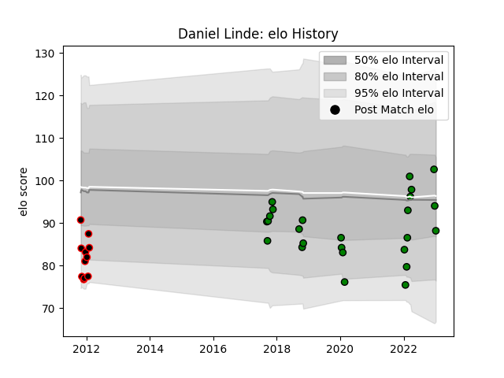

---  
layout: page  
title: Daniel Linde  
date: 2023-03-21 18:55:34.190778  
categories: player  
---
# Daniel Linde

Last updated: 2023-03-21
## Positions: L, FL

## Current elo: 82.0

## Current Percentile: 21.0

# Elo History

# Match History

| Team                 |   Appearances |   Win Rate |
|:---------------------|--------------:|-----------:|
| Mitsubishi Dynaboars |            41 |   0.560976 |
| Mie Honda Heat       |            11 |   0.227273 |

| Opponent                          |   Matches |   Win Rate |
|:----------------------------------|----------:|-----------:|
| Hanazono Kintetsu Liners          |         5 |   0.6      |
| Urayasu D-Rocks                   |         4 |   0.875    |
| Toyota Verblitz                   |         3 |   0.333333 |
| Toshiba Brave Lupus Tokyo         |         3 |   0.333333 |
| Tokyo Sungoliath                  |         3 |   0        |
| Shizuoka Blue Revs                |         3 |   0.166667 |
| NTT Docomo Red Hurricanes Osaka   |         3 |   0.166667 |
| Mie Honda Heat                    |         3 |   0.333333 |
| Black Rams Tokyo                  |         2 |   0.5      |
| Kyuden Voltex                     |         2 |   1        |
| Skyactivs Hiroshima               |         2 |   1        |
| Yokohama Canon Eagles             |         2 |   0        |
| Kobelco Kobe Steelers             |         2 |   0        |
| Kamaishi Seawaves                 |         2 |   1        |
| Hino Red Dolphins                 |         2 |   1        |
| Green Rockets Tokatsu             |         2 |   0        |
| Coca-Cola Red Sparks              |         2 |   1        |
| Chubu Electric Power              |         1 |   1        |
| Kurita Water Gush                 |         1 |   1        |
| Munakata Sanix Blues              |         1 |   0        |
| Kubota Spears Funabashi Tokyo-Bay |         1 |   0        |
| Saitama Wild Knights              |         1 |   0        |
| Chugoku Red Regulions             |         1 |   1        |
| Mazda Blue Zoomers                |         1 |   1        |