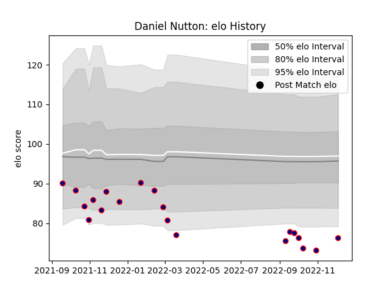

---  
layout: page  
title: Daniel Nutton  
date: 2022-12-12 15:21:43.539635  
categories: player  
---
# Daniel Nutton

## Positions: SH, FH

## Current elo: 76.0

## Current Percentile: 1.0

# Elo History

# Match History

| Team            |   Appearances |   Win Rate |
|:----------------|--------------:|-----------:|
| London Scottish |            20 |      0.125 |

| Opponent            |   Matches |   Win Rate |
|:--------------------|----------:|-----------:|
| Cornish Pirates     |         3 |   0        |
| Coventry            |         3 |   0.333333 |
| Jersey              |         3 |   0        |
| Bedford             |         2 |   0        |
| Ealing Trailfinders |         2 |   0        |
| Hartpury College    |         2 |   0.25     |
| Nottingham          |         2 |   0        |
| Ampthill            |         1 |   0        |
| Caldy               |         1 |   1        |
| Richmond            |         1 |   0        |