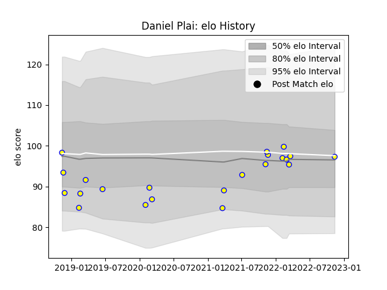

---  
layout: page  
title: Daniel Plai  
date: 2022-11-22 11:44:13.471426  
categories: player  
---
# Daniel Plai

## Positions: FH

## Country: Romania

## Current elo: 97.0

## Current Percentile: 52.0

# Elo History

# Match History

| Team    |   Appearances |   Win Rate |
|:--------|--------------:|-----------:|
| Romania |            22 |   0.545455 |

| Opponent                 |   Matches |   Win Rate |
|:-------------------------|----------:|-----------:|
| Georgia                  |         4 |   0        |
| Spain                    |         3 |   0.666667 |
| Uruguay                  |         3 |   0.333333 |
| Netherlands              |         2 |   1        |
| Portugal                 |         2 |   1        |
| Russia                   |         2 |   0.5      |
| Argentina                |         1 |   0        |
| Belgium                  |         1 |   1        |
| Brazil                   |         1 |   1        |
| Germany                  |         1 |   1        |
| Tonga                    |         1 |   1        |
| United States of America |         1 |   0        |