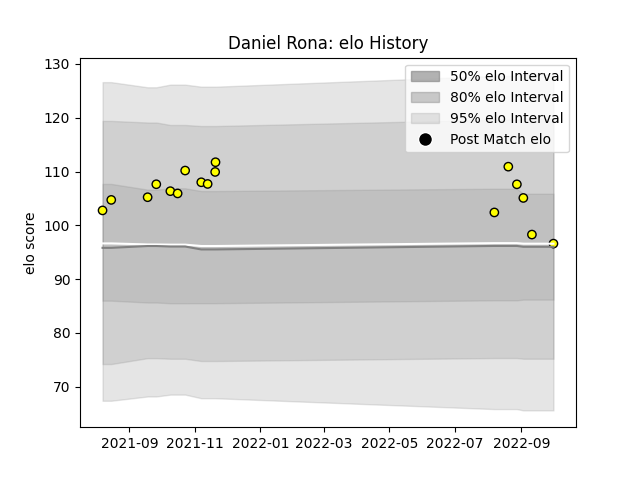

---  
layout: page  
title: Daniel Rona  
date: 2023-03-11 00:13:52.729607  
categories: player  
---
# Daniel Rona

## Positions: C

## Current elo: 97.0

## Current Percentile: 55.0

# Elo History

# Match History

| Team     |   Appearances |   Win Rate |
|:---------|--------------:|-----------:|
| Taranaki |            17 |   0.705882 |

| Opponent      |   Matches |   Win Rate |
|:--------------|----------:|-----------:|
| Otago         |         3 |        1   |
| Northland     |         2 |        0.5 |
| Southland     |         2 |        1   |
| Waikato       |         2 |        0.5 |
| Wellington    |         2 |        0.5 |
| Auckland      |         1 |        0   |
| Bay of Plenty |         1 |        1   |
| Canterbury    |         1 |        1   |
| Hawke's Bay   |         1 |        1   |
| Manawatu      |         1 |        1   |
| Tasman        |         1 |        0   |