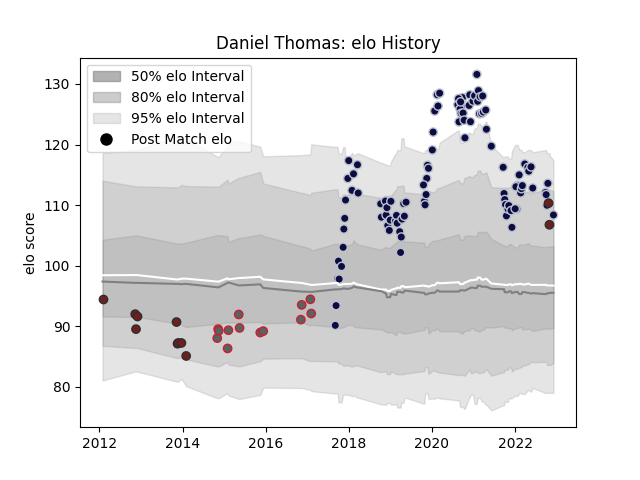

---  
layout: page  
title: Daniel Thomas  
date: 2022-12-09 13:21:47.677005  
categories: player  
---
# Daniel Thomas

## Positions: FL

## Current elo: 108.0

## Current Percentile: 82.0

# Elo History

# Match History

| Team             |   Appearances |   Win Rate |
|:-----------------|--------------:|-----------:|
| Bristol Rugby    |           103 |   0.640777 |
| Gloucester Rugby |            13 |   0.653846 |
| Scarlets         |            11 |   0.454545 |

| Opponent             |   Matches |   Win Rate |
|:---------------------|----------:|-----------:|
| Exeter Chiefs        |        10 |   0.3      |
| Worcester Warriors   |         9 |   0.555556 |
| Wasps                |         8 |   0.25     |
| Leicester Tigers     |         8 |   0.6875   |
| Harlequins           |         8 |   0.5      |
| Bath Rugby           |         7 |   0.5      |
| Saracens             |         7 |   0.428571 |
| Gloucester Rugby     |         7 |   0.714286 |
| London Irish         |         7 |   0.714286 |
| Northampton Saints   |         6 |   0.666667 |
| Newcastle Falcons    |         6 |   0.666667 |
| Sale Sharks          |         6 |   0.416667 |
| Dragons              |         3 |   1        |
| Zebre                |         3 |   1        |
| Ealing Trailfinders  |         2 |   1        |
| Connacht             |         2 |   0.5      |
| Yorkshire Carnegie   |         2 |   1        |
| Bedford              |         2 |   1        |
| Brive                |         2 |   1        |
| Munster              |         2 |   0.5      |
| Cornish Pirates      |         2 |   1        |
| La Rochelle          |         2 |   0        |
| Rotherham Titans     |         2 |   1        |
| Cardiff Blues        |         1 |   1        |
| Bordeaux Begles      |         1 |   1        |
| Toulon               |         1 |   1        |
| Stade Francais Paris |         1 |   1        |
| Scarlets             |         1 |   1        |
| Jersey               |         1 |   1        |
| Doncaster            |         1 |   1        |
| Richmond             |         1 |   1        |
| Nottingham           |         1 |   1        |
| Hartpury College     |         1 |   1        |
| London Welsh         |         1 |   1        |
| London Scottish      |         1 |   1        |
| Leinster             |         1 |   0        |
| Ospreys              |         1 |   1        |