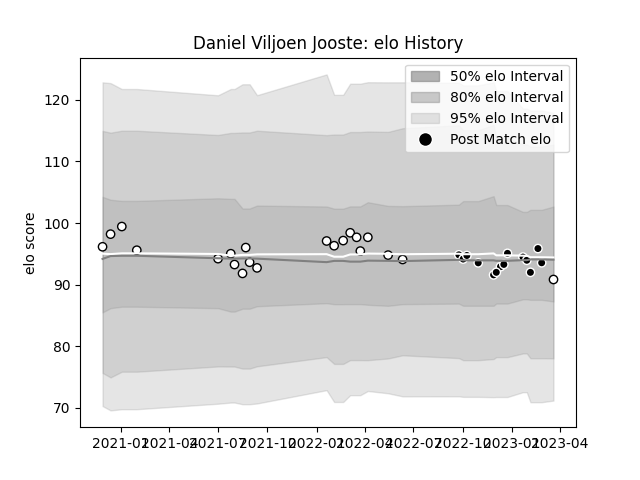

---  
layout: page  
title: Daniel Viljoen Jooste  
date: 2023-03-21 18:22:07.305424  
categories: player  
---
# Daniel Viljoen Jooste

Last updated: 2023-03-21
## Positions: H

## Current elo: 91.0

## Current Percentile: 46.0

# Elo History

# Match History

| Team         |   Appearances |   Win Rate |
|:-------------|--------------:|-----------:|
| Natal Sharks |            21 |   0.52381  |
| Sharks       |            14 |   0.571429 |

| Opponent            |   Matches |   Win Rate |
|:--------------------|----------:|-----------:|
| Griquas             |         5 |       0.6  |
| Blue Bulls          |         4 |       0.25 |
| Western Province    |         4 |       0.25 |
| Free State Cheetahs |         4 |       0.5  |
| Golden Lions        |         2 |       1    |
| Pumas               |         2 |       1    |
| Lions               |         2 |       1    |
| Harlequins          |         2 |       0.5  |
| Edinburgh           |         1 |       1    |
| Bordeaux Begles     |         1 |       1    |
| Leinster            |         1 |       0    |
| Dragons             |         1 |       1    |
| Ospreys             |         1 |       1    |
| Cardiff Blues       |         1 |       0    |
| Stormers            |         1 |       0    |
| Ulster              |         1 |       0    |
| Bulls               |         1 |       0    |
| Zebre               |         1 |       1    |