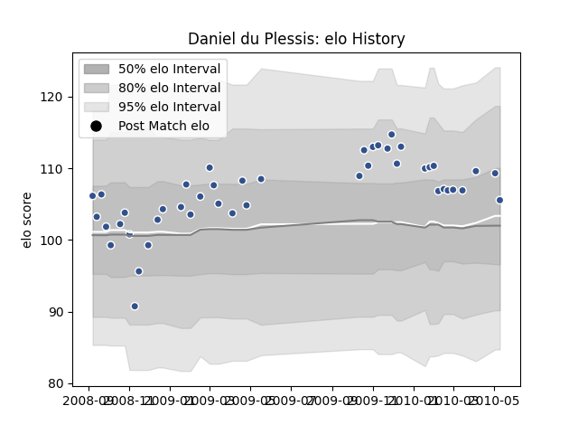

---  
layout: page  
title: Daniel du Plessis  
date: 2022-12-09 13:12:30.413992  
categories: player  
---
# Daniel du Plessis

## Positions: C

## Current elo: 101.0

## Current Percentile: 66.0

# Elo History

# Match History

| Team   |   Appearances |   Win Rate |
|:-------|--------------:|-----------:|
| Agen   |            33 |   0.651515 |

| Opponent        |   Matches |   Win Rate |
|:----------------|----------:|-----------:|
| Narbonne        |         3 |   0.333333 |
| Pau             |         3 |   0.666667 |
| Oyonnax         |         3 |   0.333333 |
| Grenoble        |         3 |   0.833333 |
| La Rochelle     |         3 |   0.666667 |
| Lyon            |         2 |   1        |
| Tarbes          |         2 |   0        |
| Racing 92       |         2 |   0.5      |
| US Bressane     |         2 |   1        |
| Colomiers       |         2 |   1        |
| Aurillac        |         2 |   1        |
| Mont-de-Marsan  |         1 |   1        |
| Auch            |         1 |   1        |
| Bordeaux Begles |         1 |   0        |
| Provence Rugby  |         1 |   1        |
| Beziers         |         1 |   0        |
| Albi            |         1 |   1        |