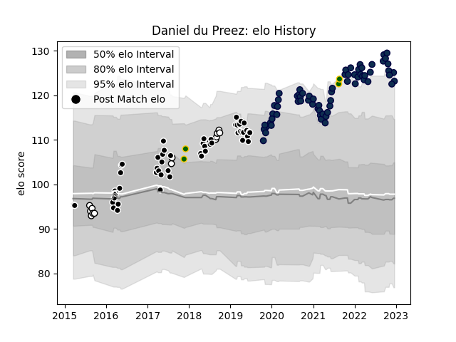

---  
layout: page  
title: Daniel du Preez  
date: 2022-12-18 16:33:43.762848  
categories: player  
---
# Daniel du Preez

## Positions: N8

## Country: South Africa

## Current elo: 123.0

## Current Percentile: 95.0

# Elo History

# Match History

| Team         |   Appearances |   Win Rate |
|:-------------|--------------:|-----------:|
| Sale Sharks  |            66 |   0.606061 |
| Sharks       |            53 |   0.556604 |
| Natal Sharks |            13 |   0.692308 |
| South Africa |             4 |   0.75     |

| Opponent                 |   Matches |   Win Rate |
|:-------------------------|----------:|-----------:|
| Jaguares                 |         8 |  0.625     |
| Northampton Saints       |         7 |  0.857143  |
| Harlequins               |         7 |  0.571429  |
| Gloucester Rugby         |         7 |  0.714286  |
| Exeter Chiefs            |         7 |  0.428571  |
| Lions                    |         7 |  0.428571  |
| Bulls                    |         6 |  0.0833333 |
| Bristol Rugby            |         6 |  0.666667  |
| Stormers                 |         6 |  0.666667  |
| Saracens                 |         5 |  0.2       |
| Wasps                    |         5 |  0.8       |
| Bath Rugby               |         5 |  0.3       |
| Southern Kings           |         4 |  0.75      |
| Leicester Tigers         |         4 |  1         |
| Pumas                    |         4 |  0.75      |
| London Irish             |         4 |  0.875     |
| Chiefs                   |         3 |  0.666667  |
| Crusaders                |         3 |  0.166667  |
| Golden Lions             |         3 |  0.333333  |
| Newcastle Falcons        |         3 |  0.666667  |
| Western Force            |         2 |  1         |
| Melbourne Rebels         |         2 |  0.75      |
| Sunwolves                |         2 |  1         |
| Argentina                |         2 |  1         |
| Eastern Province Kings   |         2 |  1         |
| Hurricanes               |         2 |  0.5       |
| Blues                    |         2 |  0.5       |
| Cheetahs                 |         2 |  1         |
| Worcester Warriors       |         2 |  0.5       |
| Glasgow Warriors         |         1 |  0         |
| Free State Cheetahs      |         1 |  1         |
| Queensland Reds          |         1 |  0         |
| France                   |         1 |  1         |
| Griquas                  |         1 |  1         |
| Stade Toulousain         |         1 |  0         |
| New South Wales Waratahs |         1 |  1         |
| Brumbies                 |         1 |  0         |
| Ulster                   |         1 |  1         |
| Wales                    |         1 |  0         |
| Highlanders              |         1 |  1         |
| Blue Bulls               |         1 |  1         |
| Western Province         |         1 |  0         |
| La Rochelle              |         1 |  0         |