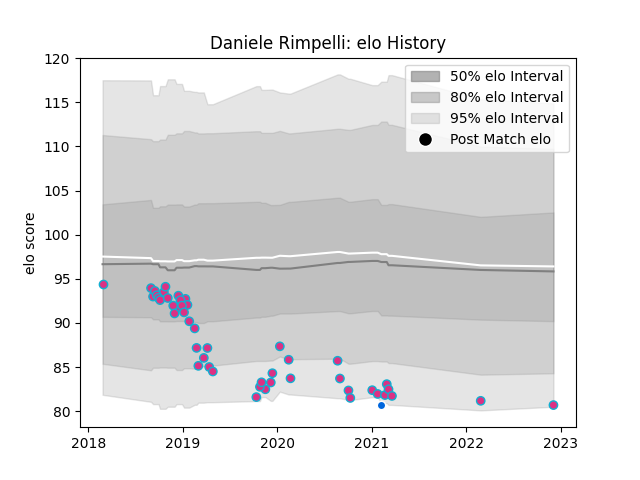

---  
layout: page  
title: Daniele Rimpelli  
date: 2022-12-09 13:21:43.153004  
categories: player  
---
# Daniele Rimpelli

## Positions: P

## Country: Italy

## Current elo: 81.0

## Current Percentile: None

# Elo History

# Match History

| Team   |   Appearances |   Win Rate |
|:-------|--------------:|-----------:|
| Zebre  |            48 |   0.229167 |
| Italy  |             1 |   0        |

| Opponent             |   Matches |   Win Rate |
|:---------------------|----------:|-----------:|
| Benetton Treviso     |         6 |   0.333333 |
| Glasgow Warriors     |         5 |   0        |
| Cardiff Blues        |         4 |   0.25     |
| Ulster               |         3 |   0        |
| Dragons              |         3 |   0.333333 |
| Ospreys              |         3 |   0        |
| Munster              |         3 |   0        |
| Leinster             |         2 |   0        |
| Scarlets             |         2 |   0        |
| RC Enisei            |         2 |   1        |
| Brive                |         2 |   0.5      |
| Bristol Rugby        |         2 |   0.5      |
| Edinburgh            |         2 |   0.5      |
| Connacht             |         2 |   0        |
| Cheetahs             |         2 |   0        |
| La Rochelle          |         2 |   0        |
| Bulls                |         1 |   0        |
| France               |         1 |   0        |
| Southern Kings       |         1 |   1        |
| Stade Francais Paris |         1 |   1        |