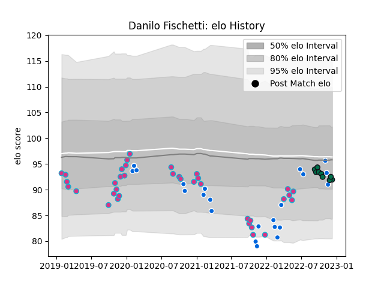

---  
layout: page  
title: Danilo Fischetti  
date: 2022-12-14 11:19:22.526188  
categories: player  
---
# Danilo Fischetti

## Positions: P

## Country: Italy

## Current elo: 92.0

## Current Percentile: 27.0

# Elo History

# Match History

| Team         |   Appearances |   Win Rate |
|:-------------|--------------:|-----------:|
| Zebre        |            36 |   0.236111 |
| Italy        |            22 |   0.227273 |
| London Irish |             9 |   0.333333 |

| Opponent             |   Matches |   Win Rate |
|:---------------------|----------:|-----------:|
| Benetton Treviso     |         8 |   0.375    |
| Glasgow Warriors     |         4 |   0        |
| Edinburgh            |         4 |   0        |
| England              |         3 |   0        |
| Scotland             |         3 |   0        |
| Leinster             |         3 |   0        |
| France               |         3 |   0        |
| Dragons              |         3 |   0.666667 |
| Ulster               |         3 |   0        |
| Bristol Rugby        |         3 |   0.166667 |
| Wales                |         3 |   0.333333 |
| Cheetahs             |         2 |   0.5      |
| Brive                |         2 |   1        |
| Ireland              |         2 |   0        |
| Sale Sharks          |         1 |   0        |
| Samoa                |         1 |   1        |
| Scarlets             |         1 |   0        |
| Argentina            |         1 |   0        |
| South Africa         |         1 |   0        |
| Stade Francais Paris |         1 |   0        |
| Northampton Saints   |         1 |   0        |
| Uruguay              |         1 |   1        |
| Portugal             |         1 |   1        |
| Leicester Tigers     |         1 |   0        |
| Newcastle Falcons    |         1 |   1        |
| New Zealand          |         1 |   0        |
| Montpellier Herault  |         1 |   0        |
| Lions                |         1 |   0        |
| Australia            |         1 |   1        |
| Gloucester Rugby     |         1 |   0        |
| Georgia              |         1 |   0        |
| Connacht             |         1 |   0        |
| Cardiff Blues        |         1 |   0        |
| Bath Rugby           |         1 |   1        |
| Worcester Warriors   |         1 |   1        |