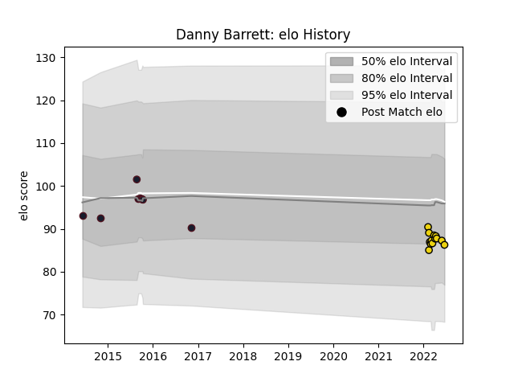

---  
layout: page  
title: Danny Barrett  
date: 2023-03-17 17:36:01.822164  
categories: player  
---
# Danny Barrett

## Positions: FL, N8

## Country: United States of America

## Current elo: 86.0

## Current Percentile: 26.0

# Elo History

# Match History

| Team                     |   Appearances |   Win Rate |
|:-------------------------|--------------:|-----------:|
| Houston SaberCats        |            13 |   0.384615 |
| United States of America |             9 |   0.111111 |

| Opponent          |   Matches |   Win Rate |
|:------------------|----------:|-----------:|
| Seattle Seawolves |         3 |   0.333333 |
| Dallas Jackals    |         2 |   1        |
| L. A. Giltinis    |         2 |   0.5      |
| Scotland          |         2 |   0        |
| Austin Gilgronis  |         1 |   0        |
| Rugby New York    |         1 |   0        |
| South Africa      |         1 |   0        |
| San Diego Legion  |         1 |   0        |
| Samoa             |         1 |   0        |
| R.U. New York     |         1 |   0        |
| Rugby ATL         |         1 |   0        |
| Australia         |         1 |   0        |
| New Zealand Maori |         1 |   0        |
| New Zealand       |         1 |   0        |
| Japan             |         1 |   0        |
| Canada            |         1 |   1        |
| Utah Warriors     |         1 |   1        |