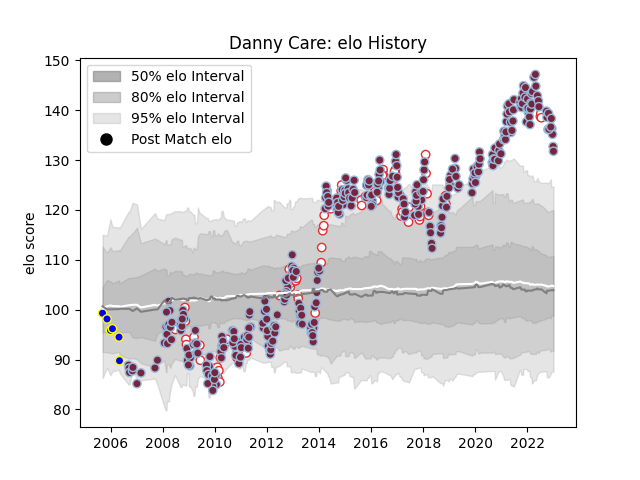

---  
layout: page  
title: Danny Care  
date: 2023-03-21 17:56:14.635848  
categories: player  
---
# Danny Care

Last updated: 2023-03-21
## Positions: SH

## Country: England

## Current elo: 108.0

## Current Percentile: 82.0

# Elo History

# Match History

| Team       |   Appearances |   Win Rate |
|:-----------|--------------:|-----------:|
| Harlequins |           345 |   0.573913 |
| England    |            85 |   0.658824 |
| Leeds      |             6 |   0        |

| Opponent             |   Matches |   Win Rate |
|:---------------------|----------:|-----------:|
| Wasps                |        29 |   0.637931 |
| Saracens             |        27 |   0.296296 |
| Gloucester Rugby     |        27 |   0.648148 |
| Sale Sharks          |        25 |   0.52     |
| Leicester Tigers     |        25 |   0.44     |
| London Irish         |        24 |   0.583333 |
| Bath Rugby           |        23 |   0.652174 |
| Northampton Saints   |        21 |   0.47619  |
| Exeter Chiefs        |        21 |   0.428571 |
| Worcester Warriors   |        19 |   0.789474 |
| Newcastle Falcons    |        19 |   0.789474 |
| Bristol Rugby        |        15 |   0.4      |
| Australia            |        14 |   0.642857 |
| France               |        10 |   0.6      |
| Argentina            |         8 |   0.875    |
| Wales                |         8 |   0.875    |
| Ireland              |         8 |   0.375    |
| New Zealand          |         8 |   0.125    |
| Scotland             |         8 |   0.8125   |
| South Africa         |         7 |   0.357143 |
| Italy                |         7 |   1        |
| Stade Francais Paris |         6 |   0.666667 |
| Racing 92            |         5 |   0.6      |
| Cardiff Blues        |         5 |   0.8      |
| Montpellier Herault  |         5 |   0.4      |
| London Welsh         |         4 |   1        |
| Leeds                |         4 |   1        |
| Stade Toulousain     |         4 |   0.25     |
| Ulster               |         4 |   0.25     |
| Connacht             |         4 |   0.75     |
| Leinster             |         3 |   0.333333 |
| Munster              |         3 |   0.333333 |
| Clermont Auvergne    |         3 |   0        |
| Castres Olympique    |         3 |   1        |
| Yorkshire Carnegie   |         3 |   1        |
| Scarlets             |         3 |   0.666667 |
| Sharks               |         2 |   0.5      |
| Timisoara Saracens   |         2 |   1        |
| Zebre                |         2 |   1        |
| Samoa                |         2 |   1        |
| La Rochelle          |         2 |   0        |
| Grenoble             |         2 |   1        |
| Fiji                 |         2 |   1        |
| Edinburgh            |         2 |   0        |
| Biarritz Olympique   |         2 |   1        |
| Pacific Islands      |         1 |   1        |
| Japan                |         1 |   1        |
| Toulon               |         1 |   0        |
| Uruguay              |         1 |   1        |
| Bayonne              |         1 |   0        |
| Agen                 |         1 |   1        |