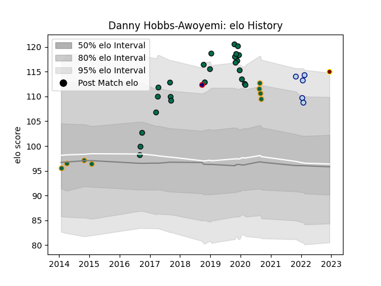

---  
layout: page  
title: Danny Hobbs-Awoyemi  
date: 2022-12-18 16:34:38.597771  
categories: player  
---
# Danny Hobbs-Awoyemi

## Positions: P

## Current elo: 115.0

## Current Percentile: 94.0

# Elo History

# Match History

| Team               |   Appearances |   Win Rate |
|:-------------------|--------------:|-----------:|
| London Irish       |            25 |       0.62 |
| Northampton Saints |             8 |       0.5  |
| Bedford            |             5 |       0.4  |
| Ampthill           |             1 |       0.5  |
| London Scottish    |             1 |       1    |

| Opponent            |   Matches |   Win Rate |
|:--------------------|----------:|-----------:|
| Richmond            |         4 |   0.625    |
| Wasps               |         3 |   0.333333 |
| Sale Sharks         |         3 |   0.333333 |
| Hartpury College    |         3 |   0.666667 |
| Bristol Rugby       |         2 |   0.25     |
| Cornish Pirates     |         2 |   1        |
| Doncaster           |         2 |   1        |
| Scarlets            |         2 |   0        |
| Harlequins          |         2 |   0.5      |
| Leicester Tigers    |         2 |   0.5      |
| Ampthill            |         1 |   0        |
| Nottingham          |         1 |   1        |
| Toulon              |         1 |   0        |
| Saracens            |         1 |   0        |
| Rotherham Titans    |         1 |   1        |
| Jersey              |         1 |   1        |
| Newcastle Falcons   |         1 |   1        |
| London Irish        |         1 |   1        |
| Bath Rugby          |         1 |   0        |
| Gloucester Rugby    |         1 |   1        |
| Exeter Chiefs       |         1 |   0        |
| Ealing Trailfinders |         1 |   1        |
| Dragons             |         1 |   1        |
| Bayonne             |         1 |   1        |
| Yorkshire Carnegie  |         1 |   1        |