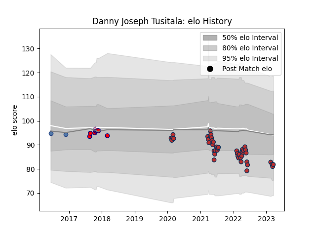

---  
layout: page  
title: Danny Joseph Tusitala  
date: 2023-03-09 10:07:11.367112  
categories: player  
---
# Danny Joseph Tusitala

## Positions: SH

## Country: Samoa

## Current elo: 82.0

## Current Percentile: 17.0

# Elo History

# Match History

| Team         |   Appearances |   Win Rate |
|:-------------|--------------:|-----------:|
| Old Glory DC |            43 |   0.337209 |
| Aurillac     |             9 |   0.388889 |
| Samoa        |             2 |   0.75     |

| Opponent               |   Matches |   Win Rate |
|:-----------------------|----------:|-----------:|
| Toronto Arrows         |         5 |   0.2      |
| Rugby New York         |         5 |   0        |
| Rugby ATL              |         5 |   0.4      |
| NOLA Gold              |         5 |   0.1      |
| R.U. New York          |         4 |   0        |
| New England Free Jacks |         4 |   0.25     |
| Houston SaberCats      |         3 |   0.666667 |
| Austin Gilgronis       |         2 |   0.5      |
| Seattle Seawolves      |         2 |   1        |
| San Diego Legion       |         2 |   0.5      |
| Utah Warriors          |         2 |   0.5      |
| L. A. Giltinis         |         1 |   0        |
| Massy                  |         1 |   0        |
| Austin Herd            |         1 |   1        |
| Montauban              |         1 |   0.5      |
| Georgia                |         1 |   0.5      |
| Nevers                 |         1 |   1        |
| Dax                    |         1 |   0        |
| Perpignan              |         1 |   1        |
| Dallas Jackals         |         1 |   1        |
| Colomiers              |         1 |   0        |
| Chicago Hounds         |         1 |   1        |
| Carcassonne            |         1 |   0        |
| Canada                 |         1 |   1        |
| Biarritz Olympique     |         1 |   1        |
| Mont-de-Marsan         |         1 |   0        |