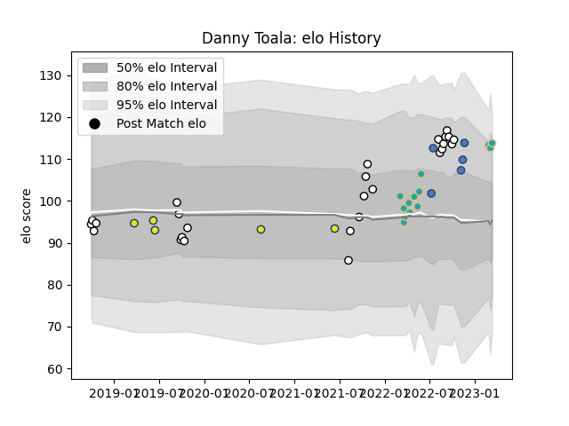

---  
layout: page  
title: Danny Toala  
date: 2023-03-02 11:24:11.904811  
categories: player  
---
# Danny Toala

## Positions: C, FB

## Country: Samoa

## Current elo: 113.0

## Current Percentile: 87.0

# Elo History

# Match History

| Team           |   Appearances |   Win Rate |
|:---------------|--------------:|-----------:|
| Hawke's Bay    |            26 |   0.557692 |
| Moana Pasifika |            11 |   0.181818 |
| Hurricanes     |             5 |   0.8      |
| Samoa          |             5 |   0.8      |

| Opponent         |   Matches |   Win Rate |
|:-----------------|----------:|-----------:|
| Tasman           |         5 |   0.4      |
| Bay of Plenty    |         3 |   0.333333 |
| Waikato          |         3 |   0.833333 |
| Canterbury       |         3 |   0.333333 |
| Highlanders      |         2 |   0        |
| Taranaki         |         2 |   0.5      |
| Queensland Reds  |         2 |   0.5      |
| Otago            |         2 |   0.5      |
| Manawatu         |         2 |   1        |
| Hurricanes       |         2 |   0.5      |
| Wellington       |         2 |   0        |
| Fijian Drua      |         2 |   0        |
| Counties Manukau |         2 |   1        |
| Chiefs           |         2 |   0        |
| Georgia          |         1 |   1        |
| Italy            |         1 |   0        |
| Blues            |         1 |   1        |
| Melbourne Rebels |         1 |   0        |
| North Harbour    |         1 |   1        |
| Fiji             |         1 |   1        |
| Crusaders        |         1 |   0        |
| Romania          |         1 |   1        |
| Southland        |         1 |   1        |
| Stormers         |         1 |   1        |
| Tonga            |         1 |   1        |
| Brumbies         |         1 |   1        |
| Lions            |         1 |   1        |