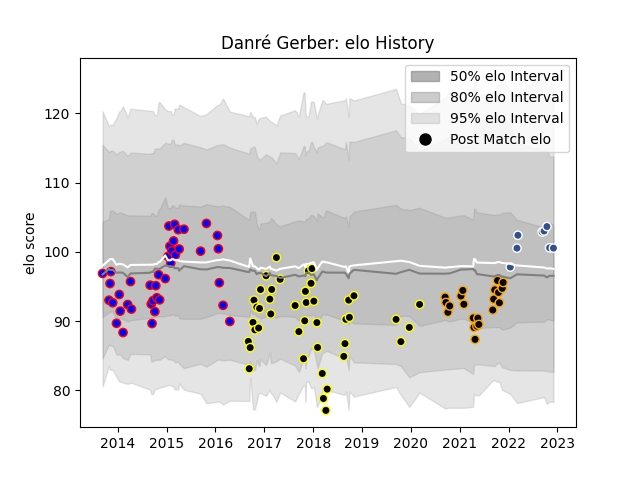

---  
layout: page  
title: Danré Gerber  
date: 2023-01-13 11:33:28.659476  
categories: player  
---
# Danré Gerber

## Positions: C, FH

## Current elo: 79.0

## Current Percentile: 15.0

# Elo History

# Match History

| Team           |   Appearances |   Win Rate |
|:---------------|--------------:|-----------:|
| Mont-de-Marsan |            66 |   0.522727 |
| Beziers        |            62 |   0.427419 |
| Chambery       |            25 |   0.5      |
| Agen           |            20 |   0.475    |

| Opponent                   |   Matches |   Win Rate |
|:---------------------------|----------:|-----------:|
| Aurillac                   |        12 |   0.416667 |
| Dax                        |        10 |   0.6      |
| Perpignan                  |         9 |   0.555556 |
| Carcassonne                |         9 |   0.333333 |
| Colomiers                  |         9 |   0.555556 |
| Albi                       |         8 |   0.625    |
| Biarritz Olympique         |         8 |   0.375    |
| Narbonne                   |         8 |   0.5      |
| Massy                      |         7 |   0.785714 |
| Tarbes                     |         7 |   0.714286 |
| Bourgoin-Jallieu           |         7 |   0.571429 |
| Soyaux-Angouleme           |         6 |   0.333333 |
| Beziers                    |         6 |   0.666667 |
| Montauban                  |         6 |   0.333333 |
| Provence Rugby             |         5 |   0.6      |
| Nevers                     |         5 |   0.2      |
| Vannes                     |         5 |   0.4      |
| Bayonne                    |         4 |   0.5      |
| Pau                        |         4 |   0        |
| Rouen                      |         4 |   1        |
| Agen                       |         4 |   0.5      |
| Dijon                      |         3 |   0.333333 |
| Grenoble                   |         3 |   0.666667 |
| Mont-de-Marsan             |         3 |   0.5      |
| Aubenas                    |         3 |   0.666667 |
| US Bressane                |         3 |   0        |
| Lyon                       |         3 |   0        |
| Nice                       |         2 |   0        |
| Oyonnax                    |         2 |   0.5      |
| Blagnac                    |         2 |   0.5      |
| Auch                       |         2 |   0.5      |
| La Rochelle                |         1 |   0        |
| Roval Drome XV             |         1 |   0        |
| Suresnes                   |         1 |   1        |
| Valence Romans Drome Rugby |         1 |   0        |