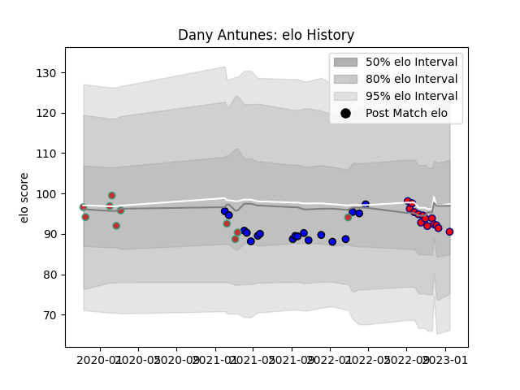

---  
layout: page  
title: Dany Antunes  
date: 2023-03-21 18:28:55.331458  
categories: player  
---
# Dany Antunes

Last updated: 2023-03-21
## Positions: FB, W

## Country: Portugal

## Current elo: 87.0

## Current Percentile: 29.0

# Elo History

# Match History

| Team                       |   Appearances |   Win Rate |
|:---------------------------|--------------:|-----------:|
| Cognac Saint Jean d'Angély |            21 |   0        |
| Massy                      |            19 |   0.631579 |
| Portugal                   |            10 |   0.4      |

| Opponent                   |   Matches |   Win Rate |
|:---------------------------|----------:|-----------:|
| Blagnac                    |         5 |   0.4      |
| Albi                       |         4 |   0.25     |
| Tarbes                     |         4 |   0.5      |
| Suresnes                   |         3 |   0.666667 |
| Chambery                   |         3 |   0.333333 |
| Rennes                     |         3 |   0        |
| Dax                        |         3 |   0.333333 |
| Nice                       |         3 |   0        |
| Aubenas                    |         2 |   1        |
| US Bressane                |         2 |   0        |
| Romania                    |         2 |   0.5      |
| Narbonne                   |         2 |   0        |
| Georgia                    |         2 |   0        |
| Carqueiranne-Hyères        |         2 |   0        |
| Bourgoin-Jallieu           |         2 |   0        |
| Netherlands                |         1 |   1        |
| Chile                      |         1 |   1        |
| Russia                     |         1 |   0        |
| Soyaux-Angouleme           |         1 |   1        |
| Spain                      |         1 |   0        |
| Brazil                     |         1 |   0        |
| Belgium                    |         1 |   1        |
| Valence Romans Drome Rugby |         1 |   0        |