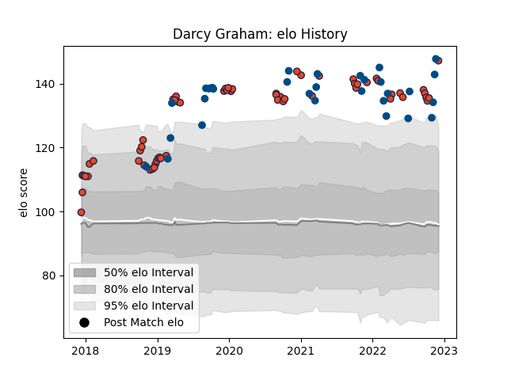

---  
layout: page  
title: Darcy Graham  
date: 2023-03-27 11:33:43.863405  
categories: player  
---
# Darcy Graham

Last updated: 2023-03-27
## Positions: W

## Country: Scotland

## Current elo: 147.0

## Current Percentile: 99.0

# Elo History

# Match History

| Team      |   Appearances |   Win Rate |
|:----------|--------------:|-----------:|
| Edinburgh |            60 |   0.541667 |
| Scotland  |            31 |   0.532258 |

| Opponent               |   Matches |   Win Rate |
|:-----------------------|----------:|-----------:|
| Glasgow Warriors       |        11 |   0.545455 |
| Wales                  |         5 |   0.2      |
| France                 |         4 |   0.25     |
| Benetton Treviso       |         4 |   0.75     |
| Dragons                |         3 |   0.666667 |
| Scarlets               |         3 |   0.666667 |
| Argentina              |         3 |   0.666667 |
| Ireland                |         3 |   0        |
| Munster                |         3 |   0        |
| Stormers               |         3 |   0.166667 |
| Georgia                |         3 |   1        |
| Lions                  |         2 |   0        |
| Stade Francais Paris   |         2 |   0.5      |
| Montpellier Herault    |         2 |   0.5      |
| Newcastle Falcons      |         2 |   1        |
| Ospreys                |         2 |   0        |
| Leinster               |         2 |   1        |
| Italy                  |         2 |   1        |
| Toulon                 |         2 |   1        |
| Japan                  |         2 |   0.5      |
| Ulster                 |         2 |   0        |
| England                |         2 |   0.75     |
| Bulls                  |         2 |   0.5      |
| Wasps                  |         2 |   1        |
| Bordeaux Begles        |         2 |   0        |
| Australia              |         2 |   0.5      |
| Tonga                  |         1 |   1        |
| Russia                 |         1 |   1        |
| Southern Kings         |         1 |   1        |
| Samoa                  |         1 |   1        |
| Agen                   |         1 |   1        |
| Racing 92              |         1 |   0        |
| Pau                    |         1 |   1        |
| New Zealand            |         1 |   0        |
| London Irish           |         1 |   1        |
| La Rochelle            |         1 |   0        |
| Krasny Yar Krasnoyarsk |         1 |   1        |
| Krasny Yar             |         1 |   1        |
| Fiji                   |         1 |   1        |
| Cheetahs               |         1 |   1        |
| Brive                  |         1 |   1        |
| Zebre                  |         1 |   0        |