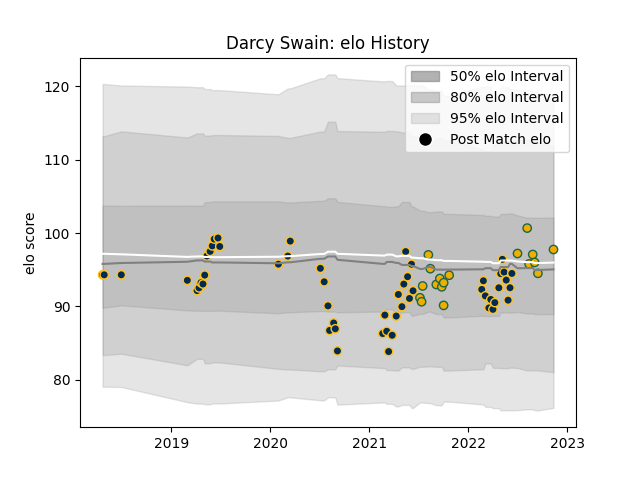

---  
layout: page  
title: Darcy Swain  
date: 2023-03-17 17:37:09.028199  
categories: player  
---
# Darcy Swain

## Positions: L

## Country: Australia

## Current elo: 95.0

## Current Percentile: 45.0

# Elo History

# Match History

| Team             |   Appearances |   Win Rate |
|:-----------------|--------------:|-----------:|
| Brumbies         |            57 |   0.649123 |
| Canberra Vikings |            23 |   0.608696 |
| Australia        |            17 |   0.588235 |

| Opponent                 |   Matches |   Win Rate |
|:-------------------------|----------:|-----------:|
| Queensland Reds          |         9 |   0.444444 |
| Western Force            |         8 |   0.875    |
| New South Wales Waratahs |         7 |   1        |
| Fijian Drua              |         6 |   0.666667 |
| Blues                    |         5 |   0.4      |
| Hurricanes               |         5 |   0.8      |
| Argentina                |         5 |   0.8      |
| Melbourne Rebels         |         4 |   0.75     |
| Queensland Country       |         4 |   0.25     |
| Crusaders                |         4 |   0        |
| New Zealand              |         4 |   0        |
| Jaguares                 |         3 |   0        |
| Sunwolves                |         3 |   1        |
| Melbourne Rising         |         3 |   1        |
| South Africa             |         3 |   0.666667 |
| France                   |         3 |   0.666667 |
| Brisbane City            |         3 |   0.666667 |
| Sydney Rays              |         2 |   1        |
| Highlanders              |         2 |   0.5      |
| Chiefs                   |         2 |   0.5      |
| NSW Country Eagles       |         2 |   0.5      |
| Stormers                 |         1 |   1        |
| Sharks                   |         1 |   1        |
| England                  |         1 |   1        |
| Perth Spirit             |         1 |   1        |
| North Harbour Rays       |         1 |   0        |
| Moana Pasifika           |         1 |   0        |
| Lions                    |         1 |   1        |
| Japan                    |         1 |   1        |
| Greater Sydney Rams      |         1 |   1        |
| Bulls                    |         1 |   1        |