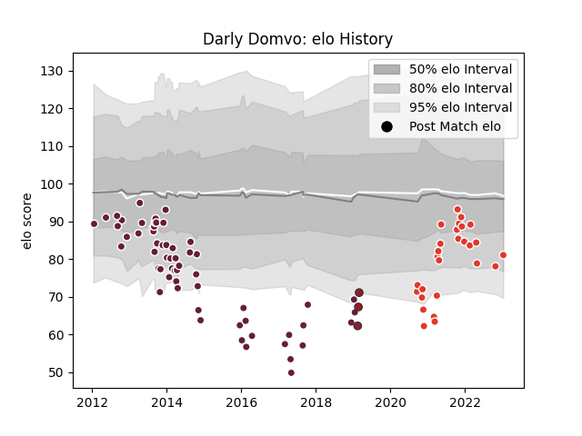

---  
layout: page  
title: Darly Domvo  
date: 2023-01-17 11:40:58.689593  
categories: player  
---
# Darly Domvo

## Positions: FB, W

## Current elo: 81.0

## Current Percentile: 11.0

# Elo History

# Match History

| Team               |   Appearances |   Win Rate |
|:-------------------|--------------:|-----------:|
| Bordeaux Begles    |            60 |   0.441667 |
| Biarritz Olympique |            27 |   0.425926 |
| Toulon             |             3 |   0.666667 |

| Opponent                   |   Matches |   Win Rate |
|:---------------------------|----------:|-----------:|
| Clermont Auvergne          |         7 |   0.428571 |
| Toulon                     |         6 |   0.166667 |
| Perpignan                  |         6 |   0.666667 |
| Stade Francais Paris       |         6 |   0.333333 |
| Castres Olympique          |         6 |   0.25     |
| Racing 92                  |         6 |   0.333333 |
| Oyonnax                    |         4 |   0.25     |
| Brive                      |         4 |   0.75     |
| Rouen                      |         3 |   0.666667 |
| Montpellier Herault        |         3 |   0        |
| Stade Toulousain           |         3 |   0.333333 |
| Bayonne                    |         3 |   0.666667 |
| Sale Sharks                |         2 |   0.5      |
| Soyaux-Angouleme           |         2 |   1        |
| Aurillac                   |         2 |   1        |
| Pau                        |         2 |   0.5      |
| Agen                       |         2 |   0.5      |
| Mont-de-Marsan             |         2 |   0        |
| Lyon                       |         2 |   0.5      |
| Biarritz Olympique         |         2 |   1        |
| Grenoble                   |         2 |   0.5      |
| Edinburgh                  |         1 |   0        |
| Valence Romans Drome Rugby |         1 |   1        |
| Bath Rugby                 |         1 |   0        |
| Beziers                    |         1 |   1        |
| Colomiers                  |         1 |   0        |
| Connacht                   |         1 |   0        |
| Gloucester Rugby           |         1 |   0        |
| London Welsh               |         1 |   1        |
| RC Enisei                  |         1 |   1        |
| Provence Rugby             |         1 |   0.5      |
| La Rochelle                |         1 |   0        |
| London Irish               |         1 |   0        |
| Ospreys                    |         1 |   1        |
| Nevers                     |         1 |   1        |
| Vannes                     |         1 |   0        |