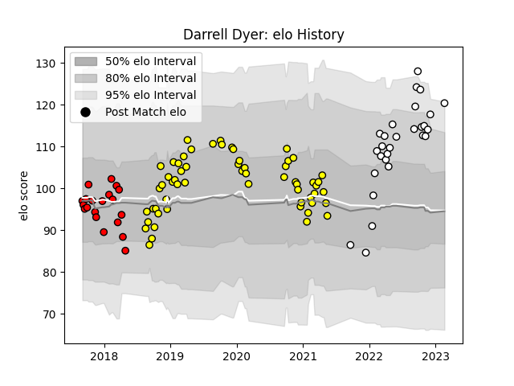

---  
layout: page  
title: Darrell Dyer  
date: 2023-02-24 02:27:26.117211  
categories: player  
---
# Darrell Dyer

## Positions: L, N8

## Current elo: 120.0

## Current Percentile: 93.0

# Elo History

# Match History

| Team                       |   Appearances |   Win Rate |
|:---------------------------|--------------:|-----------:|
| Carcassonne                |            59 |   0.508475 |
| Valence Romans Drome Rugby |            28 |   0.589286 |
| Hartpury College           |            20 |   0.325    |

| Opponent                   |   Matches |   Win Rate |
|:---------------------------|----------:|-----------:|
| Aurillac                   |         6 |   0.5      |
| Mont-de-Marsan             |         5 |   0.6      |
| Beziers                    |         5 |   0.4      |
| Biarritz Olympique         |         5 |   0.4      |
| Soyaux-Angouleme           |         5 |   0.6      |
| Nevers                     |         5 |   0.6      |
| Vannes                     |         4 |   0.5      |
| Oyonnax                    |         4 |   0.25     |
| Dax                        |         3 |   0.333333 |
| US Bressane                |         3 |   0.666667 |
| Nice                       |         3 |   0.666667 |
| Provence Rugby             |         3 |   0.666667 |
| Perpignan                  |         3 |   0        |
| Colomiers                  |         3 |   0.666667 |
| Montauban                  |         2 |   0        |
| Nottingham                 |         2 |   0.5      |
| Albi                       |         2 |   0        |
| Massy                      |         2 |   0.5      |
| Rotherham Titans           |         2 |   1        |
| Rouen                      |         2 |   1        |
| Tarbes                     |         2 |   0.5      |
| Richmond                   |         2 |   0        |
| London Scottish            |         2 |   1        |
| Yorkshire Carnegie         |         2 |   0.25     |
| Bourgoin-Jallieu           |         2 |   0.75     |
| Grenoble                   |         2 |   0.5      |
| Bayonne                    |         2 |   0.5      |
| Doncaster                  |         2 |   0.5      |
| Dijon                      |         2 |   0.5      |
| Cornish Pirates            |         2 |   0        |
| Cognac Saint Jean d'Angély |         2 |   1        |
| Jersey                     |         2 |   0        |
| Blagnac                    |         2 |   0.5      |
| Bristol Rugby              |         2 |   0        |
| Valence Romans Drome Rugby |         1 |   0        |
| Bedford                    |         1 |   0        |
| Suresnes                   |         1 |   1        |
| Aubenas                    |         1 |   1        |
| Brive                      |         1 |   1        |
| Carqueiranne-Hyères        |         1 |   1        |
| Chambery                   |         1 |   1        |
| Ealing Trailfinders        |         1 |   0        |
| Narbonne                   |         1 |   1        |
| Rennes                     |         1 |   1        |