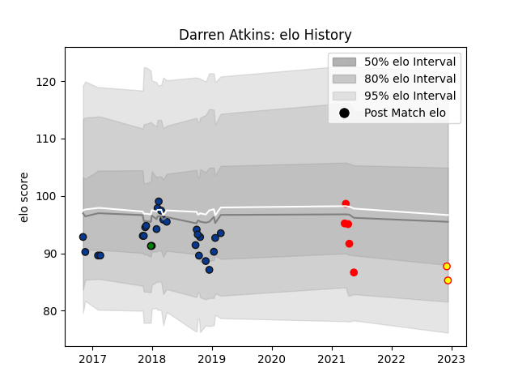

---  
layout: page  
title: Darren Atkins  
date: 2022-12-14 11:26:52.864510  
categories: player  
---
# Darren Atkins

## Positions: FB, W

## Current elo: 85.0

## Current Percentile: None

# Elo History

# Match History

| Team               |   Appearances |   Win Rate |
|:-------------------|--------------:|-----------:|
| Bath Rugby         |            25 |       0.54 |
| Jersey             |             5 |       0.2  |
| Richmond           |             2 |       0.25 |
| Yorkshire Carnegie |             1 |       1    |

| Opponent            |   Matches |   Win Rate |
|:--------------------|----------:|-----------:|
| Northampton Saints  |         4 |   0.75     |
| Wasps               |         3 |   0.5      |
| Newcastle Falcons   |         3 |   0.333333 |
| Stade Toulousain    |         2 |   0        |
| Exeter Chiefs       |         2 |   0        |
| Harlequins          |         2 |   1        |
| Leicester Tigers    |         2 |   0.5      |
| London Irish        |         2 |   1        |
| Saracens            |         1 |   0        |
| Sale Sharks         |         1 |   1        |
| Richmond            |         1 |   0        |
| Ospreys             |         1 |   1        |
| Nottingham          |         1 |   1        |
| Ampthill            |         1 |   0.5      |
| Bedford             |         1 |   1        |
| Jersey              |         1 |   0        |
| Ealing Trailfinders |         1 |   0        |
| Doncaster           |         1 |   0        |
| Coventry            |         1 |   0        |
| Bristol Rugby       |         1 |   1        |
| Leinster            |         1 |   0        |