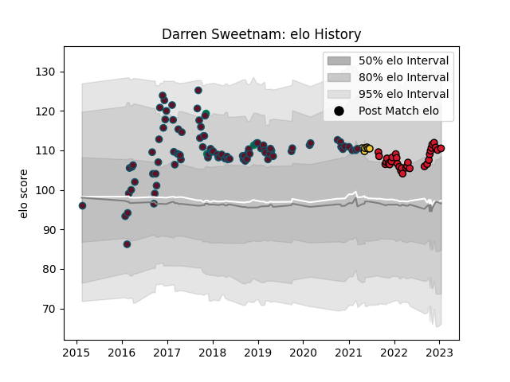

---  
layout: page  
title: Darren Sweetnam  
date: 2022-11-22 11:42:51.398887  
categories: player  
---
# Darren Sweetnam

## Positions: W

## Country: Ireland

## Current elo: 114.0

## Current Percentile: 90.0

# Elo History

# Match History

| Team        |   Appearances |   Win Rate |
|:------------|--------------:|-----------:|
| Munster     |            91 |   0.730769 |
| Oyonnax     |            28 |   0.75     |
| La Rochelle |             5 |   0.6      |
| Ireland     |             3 |   1        |

| Opponent                 |   Matches |   Win Rate |
|:-------------------------|----------:|-----------:|
| Cardiff Blues            |        10 |   0.6      |
| Zebre                    |         9 |   1        |
| Glasgow Warriors         |         8 |   0.625    |
| Ospreys                  |         8 |   0.875    |
| Benetton Treviso         |         7 |   1        |
| Leinster                 |         7 |   0.285714 |
| Dragons                  |         7 |   1        |
| Scarlets                 |         6 |   0.666667 |
| Ulster                   |         5 |   0.5      |
| Leicester Tigers         |         4 |   0.75     |
| Edinburgh                |         4 |   0.75     |
| Rouen                    |         3 |   0.666667 |
| Provence Rugby           |         3 |   0.5      |
| Agen                     |         3 |   1        |
| Connacht                 |         3 |   0.333333 |
| Beziers                  |         3 |   0.833333 |
| Cheetahs                 |         3 |   1        |
| Saracens                 |         2 |   0        |
| Vannes                   |         2 |   1        |
| Carcassonne              |         2 |   1        |
| Colomiers                |         2 |   0        |
| Bayonne                  |         2 |   0.5      |
| Racing 92                |         2 |   1        |
| Southern Kings           |         2 |   1        |
| Narbonne                 |         2 |   1        |
| Nevers                   |         2 |   1        |
| Stade Toulousain         |         1 |   1        |
| Fiji                     |         1 |   1        |
| South Africa             |         1 |   1        |
| US Bressane              |         1 |   1        |
| United States of America |         1 |   1        |
| Toulon                   |         1 |   1        |
| Castres Olympique        |         1 |   0.5      |
| Brive                    |         1 |   0        |
| Exeter Chiefs            |         1 |   0.5      |
| Pau                      |         1 |   1        |
| Montpellier Herault      |         1 |   0        |
| Montauban                |         1 |   0        |
| Lyon                     |         1 |   1        |
| Grenoble                 |         1 |   1        |
| Gloucester Rugby         |         1 |   1        |
| Massy                    |         1 |   1        |