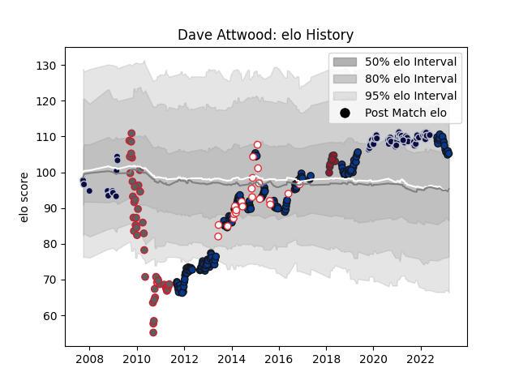

---  
layout: page  
title: Dave Attwood  
date: 2023-03-17 17:03:04.478665  
categories: player  
---
# Dave Attwood

## Positions: L

## Country: England

## Current elo: 105.0

## Current Percentile: 77.0

# Elo History

# Match History

| Team             |   Appearances |   Win Rate |
|:-----------------|--------------:|-----------:|
| Bath Rugby       |           171 |   0.505848 |
| Bristol Rugby    |            62 |   0.540323 |
| Gloucester Rugby |            45 |   0.533333 |
| England          |            24 |   0.666667 |
| Toulon           |             9 |   0.611111 |

| Opponent             |   Matches |   Win Rate |
|:---------------------|----------:|-----------:|
| Sale Sharks          |        24 |   0.333333 |
| Harlequins           |        23 |   0.304348 |
| Wasps                |        23 |   0.5      |
| Northampton Saints   |        23 |   0.369565 |
| Exeter Chiefs        |        21 |   0.690476 |
| Saracens             |        19 |   0.315789 |
| Gloucester Rugby     |        18 |   0.583333 |
| Leicester Tigers     |        18 |   0.555556 |
| Newcastle Falcons    |        15 |   0.733333 |
| Worcester Warriors   |        15 |   0.8      |
| London Irish         |        12 |   0.666667 |
| Bath Rugby           |         8 |   0.625    |
| Glasgow Warriors     |         7 |   0.428571 |
| Leinster             |         6 |   0.166667 |
| Montpellier Herault  |         6 |   0.666667 |
| Stade Toulousain     |         4 |   0.25     |
| Bristol Rugby        |         4 |   0.25     |
| Dragons              |         4 |   1        |
| New Zealand          |         4 |   0        |
| Stade Francais Paris |         3 |   0.666667 |
| Toulon               |         3 |   0.333333 |
| Wales                |         3 |   1        |
| Agen                 |         3 |   0.666667 |
| Brive                |         3 |   1        |
| France               |         3 |   0.333333 |
| Leeds                |         2 |   1        |
| Argentina            |         2 |   1        |
| Australia            |         2 |   1        |
| Biarritz Olympique   |         2 |   0.5      |
| Bucuresti            |         2 |   1        |
| Calvisano            |         2 |   1        |
| South Africa         |         2 |   0.5      |
| Scotland             |         2 |   1        |
| Cardiff Blues        |         2 |   0.5      |
| Samoa                |         2 |   1        |
| Yorkshire Carnegie   |         2 |   1        |
| Ireland              |         2 |   0.5      |
| Lyon                 |         2 |   0.25     |
| London Welsh         |         2 |   0.5      |
| Italy                |         2 |   1        |
| La Rochelle          |         2 |   0.5      |
| Racing 92            |         1 |   0        |
| Clermont Auvergne    |         1 |   1        |
| Scarlets             |         1 |   0        |
| Connacht             |         1 |   1        |
| Munster              |         1 |   0        |
| Bordeaux Begles      |         1 |   0        |
| Castres Olympique    |         1 |   1        |