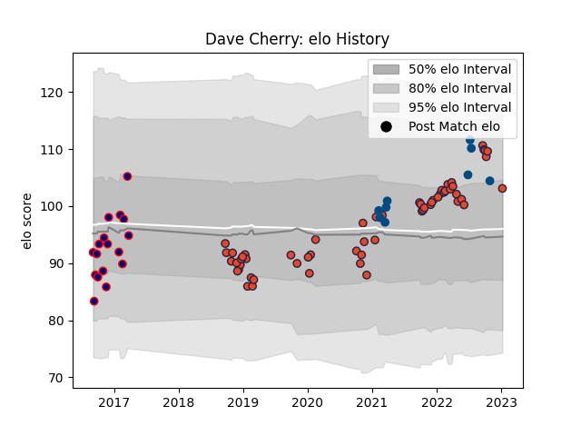

---  
layout: page  
title: Dave Cherry  
date: 2023-01-13 11:37:55.122451  
categories: player  
---
# Dave Cherry

## Positions: H

## Country: Scotland

## Current elo: 103.0

## Current Percentile: 74.0

# Elo History

# Match History

| Team            |   Appearances |   Win Rate |
|:----------------|--------------:|-----------:|
| Edinburgh       |            59 |   0.533898 |
| London Scottish |            17 |   0.352941 |
| Scotland        |             9 |   0.555556 |

| Opponent            |   Matches |   Win Rate |
|:--------------------|----------:|-----------:|
| Zebre               |         6 |   0.833333 |
| Benetton Treviso    |         6 |   0.5      |
| Scarlets            |         5 |   0.8      |
| Glasgow Warriors    |         5 |   0.6      |
| Dragons             |         4 |   0.75     |
| Cardiff Blues       |         3 |   0.666667 |
| Stormers            |         3 |   0.166667 |
| Munster             |         3 |   0        |
| Leinster            |         3 |   0        |
| Ospreys             |         2 |   0        |
| Connacht            |         2 |   0.5      |
| Cornish Pirates     |         2 |   0.5      |
| Yorkshire Carnegie  |         2 |   0        |
| Bulls               |         2 |   0.5      |
| Ulster              |         2 |   0        |
| Newcastle Falcons   |         2 |   1        |
| Southern Kings      |         2 |   0.5      |
| Richmond            |         2 |   0.5      |
| Jersey              |         2 |   0.5      |
| Argentina           |         2 |   0.5      |
| Lions               |         2 |   0        |
| London Irish        |         2 |   0        |
| Bedford             |         2 |   0.5      |
| Rotherham Titans    |         1 |   1        |
| Saracens            |         1 |   1        |
| Chile               |         1 |   1        |
| Australia           |         1 |   0        |
| Toulon              |         1 |   1        |
| Wales               |         1 |   0        |
| Sharks              |         1 |   1        |
| Montpellier Herault |         1 |   1        |
| Nottingham          |         1 |   0        |
| Bordeaux Begles     |         1 |   0        |
| London Welsh        |         1 |   0        |
| Italy               |         1 |   1        |
| Ireland             |         1 |   0        |
| Brive               |         1 |   1        |
| France              |         1 |   1        |
| England             |         1 |   1        |
| Ealing Trailfinders |         1 |   1        |
| Doncaster           |         1 |   0        |
| Agen                |         1 |   1        |