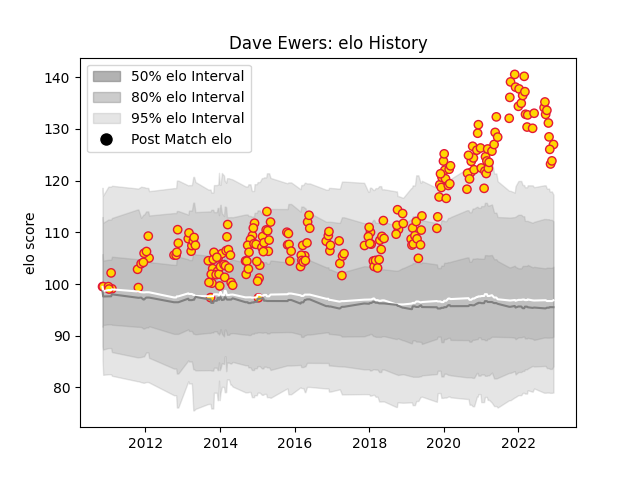

---  
layout: page  
title: Dave Ewers  
date: 2023-01-06 11:42:51.219845  
categories: player  
---
# Dave Ewers

## Positions: FL, N8

## Current elo: 128.0

## Current Percentile: 98.0

# Elo History

# Match History

| Team          |   Appearances |   Win Rate |
|:--------------|--------------:|-----------:|
| Exeter Chiefs |           211 |   0.680095 |

| Opponent            |   Matches |   Win Rate |
|:--------------------|----------:|-----------:|
| Bath Rugby          |        21 |   0.666667 |
| Harlequins          |        20 |   0.7      |
| Wasps               |        17 |   0.647059 |
| Leicester Tigers    |        17 |   0.470588 |
| Gloucester Rugby    |        16 |   0.5625   |
| Newcastle Falcons   |        15 |   0.733333 |
| Worcester Warriors  |        15 |   0.866667 |
| Sale Sharks         |        14 |   0.714286 |
| Northampton Saints  |        14 |   0.714286 |
| Saracens            |        13 |   0.384615 |
| London Irish        |        11 |   0.818182 |
| Glasgow Warriors    |         4 |   0.375    |
| London Welsh        |         4 |   1        |
| Bristol Rugby       |         4 |   0.75     |
| Cardiff Blues       |         3 |   0.833333 |
| La Rochelle         |         3 |   1        |
| Ospreys             |         3 |   0.666667 |
| Dragons             |         2 |   1        |
| Bordeaux Begles     |         2 |   0.5      |
| Toulon              |         2 |   0        |
| Connacht            |         2 |   1        |
| Stade Toulousain    |         1 |   1        |
| Scarlets            |         1 |   1        |
| Cavalieri Prato     |         1 |   1        |
| Racing 92           |         1 |   1        |
| Montpellier Herault |         1 |   1        |
| Bayonne             |         1 |   1        |
| Bulls               |         1 |   1        |
| Castres Olympique   |         1 |   1        |
| Munster             |         1 |   0.5      |