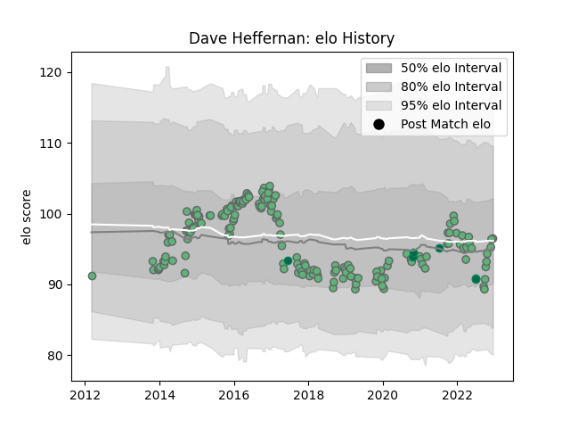

---  
layout: page  
title: Dave Heffernan  
date: 2022-12-18 16:23:45.864548  
categories: player  
---
# Dave Heffernan

## Positions: H

## Country: Ireland

## Current elo: 97.0

## Current Percentile: 55.0

# Elo History

# Match History

| Team     |   Appearances |   Win Rate |
|:---------|--------------:|-----------:|
| Connacht |           169 |   0.491124 |
| Ireland  |             6 |   0.5      |

| Opponent                 |   Matches |   Win Rate |
|:-------------------------|----------:|-----------:|
| Cardiff Blues            |        14 |   0.464286 |
| Ulster                   |        14 |   0.285714 |
| Leinster                 |        14 |   0.214286 |
| Munster                  |        13 |   0.307692 |
| Zebre                    |        13 |   0.769231 |
| Glasgow Warriors         |        12 |   0.25     |
| Scarlets                 |        11 |   0.454545 |
| Ospreys                  |        11 |   0.363636 |
| Dragons                  |         9 |   0.666667 |
| Edinburgh                |         9 |   0.555556 |
| Benetton Treviso         |         9 |   0.888889 |
| Stade Toulousain         |         4 |   0.25     |
| Cheetahs                 |         3 |   1        |
| Worcester Warriors       |         2 |   0.75     |
| Wasps                    |         2 |   0.5      |
| United States of America |         2 |   1        |
| Brive                    |         2 |   1        |
| Southern Kings           |         2 |   1        |
| RC Enisei                |         2 |   1        |
| Perpignan                |         2 |   1        |
| Newcastle Falcons        |         2 |   0.5      |
| Bayonne                  |         2 |   1        |
| Montpellier Herault      |         2 |   0.5      |
| Bulls                    |         2 |   0.5      |
| La Rochelle              |         2 |   1        |
| Gloucester Rugby         |         2 |   0.5      |
| Exeter Chiefs            |         2 |   0        |
| New Zealand              |         1 |   0        |
| Oyonnax                  |         1 |   1        |
| Lions                    |         1 |   1        |
| Sale Sharks              |         1 |   0        |
| Leicester Tigers         |         1 |   0        |
| Sharks                   |         1 |   0        |
| Italy                    |         1 |   1        |
| Stormers                 |         1 |   0        |
| Grenoble                 |         1 |   0        |
| France                   |         1 |   0        |
| New Zealand Maori        |         1 |   0        |