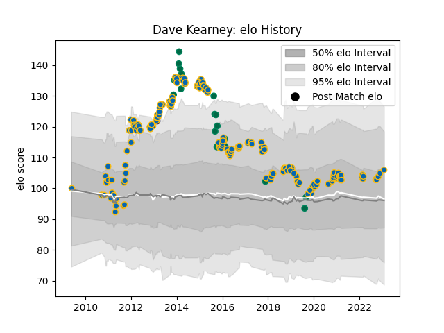

---  
layout: page  
title: Dave Kearney  
date: 2023-02-02 18:57:29.268008  
categories: player  
---
# Dave Kearney

## Positions: W

## Country: Ireland

## Current elo: 106.0

## Current Percentile: 73.0

# Elo History

# Match History

| Team      |   Appearances |   Win Rate |
|:----------|--------------:|-----------:|
| Leinster  |           174 |   0.764368 |
| Ireland   |            20 |   0.625    |
| Edinburgh |             1 |   0        |

| Opponent             |   Matches |   Win Rate |
|:---------------------|----------:|-----------:|
| Ulster               |        19 |   0.842105 |
| Ospreys              |        18 |   0.5      |
| Glasgow Warriors     |        18 |   0.611111 |
| Benetton Treviso     |        15 |   0.9      |
| Connacht             |        12 |   0.833333 |
| Dragons              |        12 |   0.75     |
| Edinburgh            |        12 |   0.916667 |
| Cardiff Blues        |        11 |   1        |
| Scarlets             |        10 |   0.8      |
| Munster              |         9 |   0.666667 |
| Zebre                |         5 |   1        |
| Wasps                |         5 |   0.5      |
| Wales                |         5 |   0.5      |
| Northampton Saints   |         4 |   0.75     |
| Toulon               |         3 |   0        |
| Southern Kings       |         3 |   1        |
| Aironi               |         3 |   1        |
| Italy                |         3 |   1        |
| France               |         3 |   0.666667 |
| Castres Olympique    |         3 |   1        |
| Clermont Auvergne    |         3 |   0.333333 |
| Scotland             |         2 |   1        |
| Bath Rugby           |         2 |   0.5      |
| Cheetahs             |         2 |   0.5      |
| England              |         2 |   0        |
| Lyon                 |         2 |   1        |
| Stade Toulousain     |         1 |   1        |
| Canada               |         1 |   1        |
| Argentina            |         1 |   0        |
| Stade Francais Paris |         1 |   1        |
| Samoa                |         1 |   1        |
| Fiji                 |         1 |   1        |
| New Zealand          |         1 |   0        |
| Montpellier Herault  |         1 |   1        |
| Lions                |         1 |   1        |