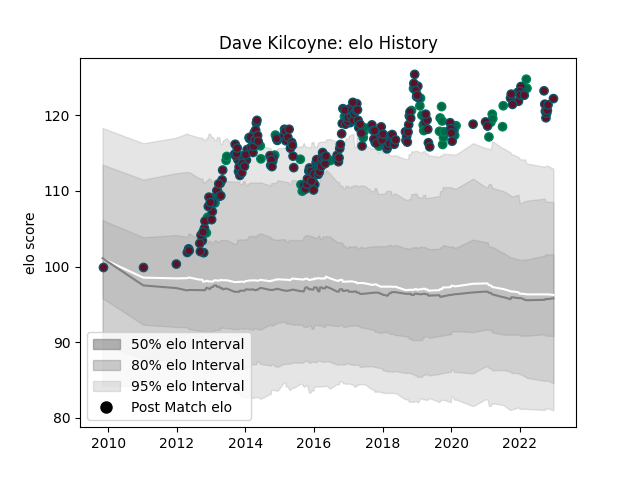

---  
layout: page  
title: Dave Kilcoyne  
date: 2023-01-06 00:26:47.266197  
categories: player  
---
# Dave Kilcoyne

## Positions: P

## Country: Ireland

## Current elo: 130.0

## Current Percentile: 98.0

# Elo History

# Match History

| Team    |   Appearances |   Win Rate |
|:--------|--------------:|-----------:|
| Munster |           205 |    0.64878 |
| Ireland |            50 |    0.75    |

| Opponent                 |   Matches |   Win Rate |
|:-------------------------|----------:|-----------:|
| Leinster                 |        20 |   0.2      |
| Glasgow Warriors         |        18 |   0.611111 |
| Connacht                 |        17 |   0.705882 |
| Ulster                   |        17 |   0.558824 |
| Edinburgh                |        17 |   0.882353 |
| Ospreys                  |        15 |   0.633333 |
| Cardiff Blues            |        13 |   0.538462 |
| Scarlets                 |        11 |   0.545455 |
| Zebre                    |        10 |   1        |
| Benetton Treviso         |         9 |   0.888889 |
| Dragons                  |         8 |   0.75     |
| Wales                    |         8 |   0.625    |
| Racing 92                |         8 |   0.5      |
| Scotland                 |         7 |   0.857143 |
| Leicester Tigers         |         6 |   0.5      |
| Castres Olympique        |         6 |   0.75     |
| England                  |         5 |   0.4      |
| Italy                    |         5 |   0.8      |
| United States of America |         4 |   1        |
| South Africa             |         4 |   0.5      |
| Saracens                 |         4 |   0.5      |
| Argentina                |         4 |   1        |
| Japan                    |         4 |   0.75     |
| Gloucester Rugby         |         4 |   1        |
| Cheetahs                 |         3 |   1        |
| Stade Toulousain         |         2 |   1        |
| Perpignan                |         2 |   1        |
| Clermont Auvergne        |         2 |   0        |
| Exeter Chiefs            |         2 |   0.75     |
| Canada                   |         2 |   1        |
| Toulon                   |         2 |   0.5      |
| France                   |         2 |   0.75     |
| Stade Francais Paris     |         2 |   0.5      |
| Wasps                    |         1 |   1        |
| Fiji                     |         1 |   1        |
| Bulls                    |         1 |   1        |
| Stormers                 |         1 |   1        |
| Sharks                   |         1 |   1        |
| Southern Kings           |         1 |   1        |
| New Zealand              |         1 |   0        |
| Georgia                  |         1 |   1        |
| Samoa                    |         1 |   1        |
| Sale Sharks              |         1 |   1        |
| Harlequins               |         1 |   1        |
| Russia                   |         1 |   1        |